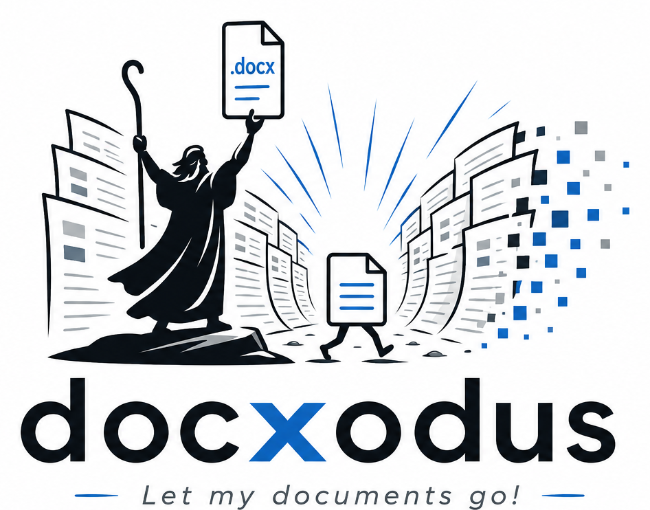
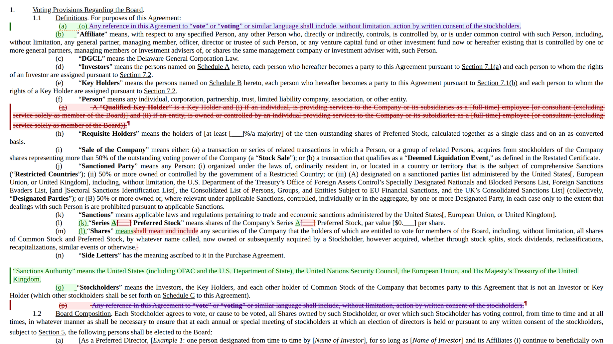
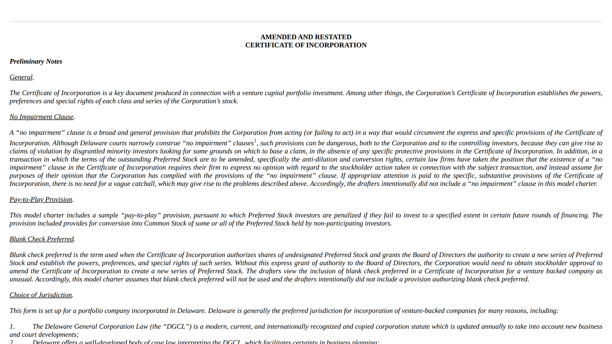
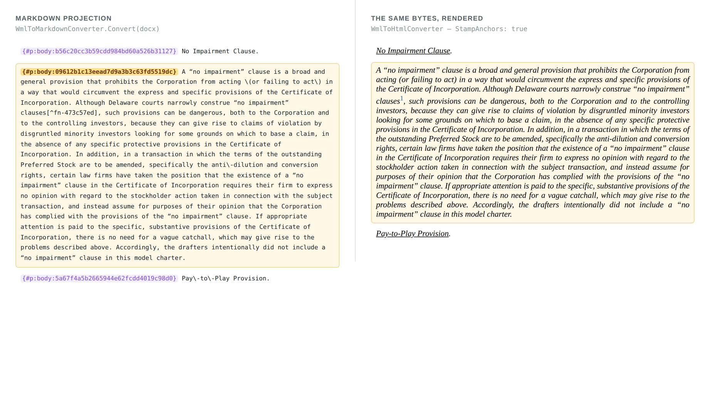
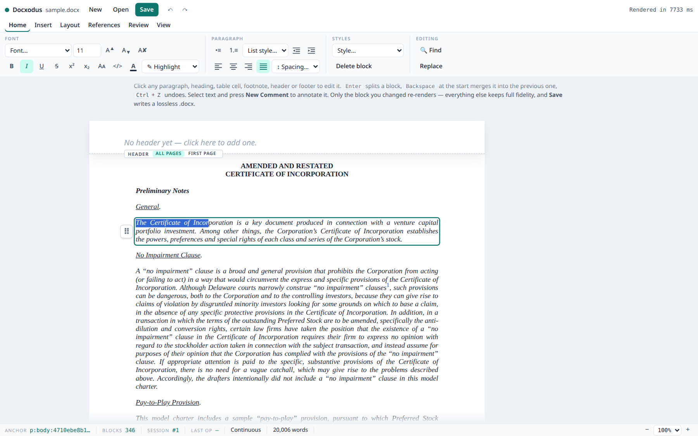
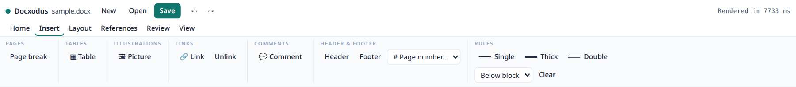
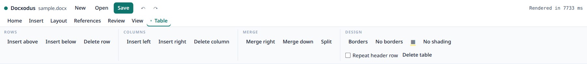

<p align="center">
  
</p>

<p align="center">
  <strong>Free your .docx files.</strong><br>
  Render them, edit them, diff them, and hand them to an agent — from .NET, the browser, Python, or the shell.
</p>

<p align="center">
  <a href="https://github.com/JSv4/Docxodus/actions/workflows/ci.yml"></a>
  <a href="https://www.nuget.org/packages/Docxodus"></a>
  <a href="https://www.npmjs.com/package/docxodus"></a>
  <a href="https://pypi.org/project/docx-scalpel/"></a>
  <a href="https://opensource.org/licenses/MIT"></a>
</p>

---

A `.docx` is a zip full of XML that only one program really understands. Docxodus is the toolkit that
changes that: a **structure-aware OOXML engine** that reads Word documents faithfully, writes them
back losslessly, and exposes them through whichever surface your program actually needs — an HTML
render, a stable markdown projection, a stateful edit session, a tracked-changes redline, or a live
in-browser editor.

It runs as a **.NET library**, a **WebAssembly module in the browser**, an **npm/TypeScript package**,
a **Python client**, and three **CLI tools** — all over the same engine, so a document behaves the
same everywhere.

```
                    ┌───────────────────────────────────────────┐
  your .docx  ──▶   │       Docxodus  ·  one OOXML engine       │   ──▶   .docx  (lossless)
                    └────┬─────────┬──────────┬──────────┬──────┘
                         │         │          │          │
                      render     edit      compare    project
```

Every screenshot below is real output, captured from the
[NVCA model financing documents](https://nvca.org/model-legal-documents/) — the venture-financing
forms that every startup lawyer actually redlines.

---

## Compare — a redline Word will open

`DocxDiff` compares two documents structurally and emits **native Word tracked-changes markup**:
`w:ins`, `w:del`, `w:moveFrom`/`w:moveTo`, and `w:pPrChange`. Not a text diff with highlighting — a
file you can hand to opposing counsel, who accepts and rejects changes in Word as usual.



One frame, four kinds of change, all detected automatically: a **struck definition** (red), an
**inserted definition** (green), **word-level substitutions** inside an otherwise untouched sentence
(`Series A` replacing a blank; `means` replacing `shall mean and include`), and a **move** — the
interpretation clause struck at the bottom in purple and re-inserted at the top, linked as one
operation rather than reported as an unrelated delete and insert. Note the list numbering: it
renumbers as if every change were already accepted — the struck `(g)` is followed by the live
`(g)`, exactly the duplicate-number display Word uses in All Markup view — so the letters a reader
cites are the final document's.

- **Round-trip contract:** `accept(compare(left, right)) ≡ right` and `reject(...) ≡ left`, verified
  at the block-text level.
- **The diff is also data.** `GetRevisions()` returns typed revisions carrying stable
  `kind:scope:unid` anchors; `GetEditScriptJson()` returns the whole edit script as JSON, so you can
  drive a review UI or an approval workflow without parsing OOXML.
- **Semantic verification.** `GetSemanticChanges()` returns a deterministic, versioned change set
  for text, formatting, styles, numbering, tables, sections, stories, review data, relationships,
  media, and opaque package changes while suppressing serialization-only noise;
  `GetSemanticChangesJson()` emits its JSON representation.
- **Deliverable gate.** `DeliverableVerifier.VerifyDeliverable()` combines bounded package/schema
  validation, cross-part closure, workflow residue, baseline-aware findings, expected deltas, and
  digest-bound renderer artifacts into one canonical pass/failed report. Default report operations
  are also available through WASM/npm, Python, and MCP.
- **Delivery change receipts.** `DeliveryChangeReceiptBuilder` binds one delivery into a
  canonical, hash-addressed record — source/delivered package identities, every normalized
  request and transaction with its undo/redo lineage, requested/derived/unexpected change
  attribution, typed semantic evidence, page citations pinned to a render fingerprint, and
  the digest of every artifact — and `DeliveryChangeReceiptVerifier` re-checks all of it
  from raw bytes, so a recipient can verify what an automated edit did (and that nothing
  else changed) without trusting the system that produced it. Core .NET today; the
  cross-surface ripple is tracked in #520.
- **N-way consolidate.** Merge many reviewers' copies against one base into a single multi-author
  tracked-changes document, with a structured conflict report.
- Headers and footers are compared too — the way Word's own "Headers and footers" option does, and
  the way `WmlComparer` never did.

Two engines ship, and they are not peers going forward:

- **`DocxDiff`** — structure-aware, anchor-addressed, diff-as-data, and **the default** on every
  surface that doesn't explicitly pick an engine (CLI, WASM, npm). This is where all active
  development happens: N-way consolidate, header/footer diffing, block-format-change tracking, and
  everything else new lands here first.
- **`WmlComparer`** — the older engine, kept available via an explicit `ComparisonEngine.WmlComparer`
  selector (wire value `0`) for callers that need its historical behavior. **`WmlComparer` will not
  be enhanced going forward** — no new capabilities, ever. Treat it as legacy: fine to keep using
  today, but new integrations should target `DocxDiff`.

See [`docs/architecture/ir_diff_engine.md`](docs/architecture/ir_diff_engine.md).

---

## Render — fidelity, not approximation

DOCX → HTML that keeps the things naive converters drop: justification, style inheritance, legal
numbering, tables, images, comments, headers and footers, and real footnotes with back-references.



- **Paginated mode** flows content into real page boxes with per-page numbers, page-anchored
  footnotes, and running heads — a print-accurate preview in the browser.
- **Tracked changes render as `<ins>`/`<del>`** with author metadata and move-aware styling (that's
  exactly what the redline screenshot above is).
- **Comments** render endnote-style, inline, or in a margin; annotations can be overlaid
  incrementally without re-converting the document (~0.3 ms to add one, vs. a full re-conversion).
- `HtmlToWmlConverter` goes the other way.

---

## Project — a text view an LLM can actually address

`WmlToMarkdownConverter` renders a document as markdown where **every block carries a stable id**.
The same document, two views, one addressing system:



An anchor like `{#p:body:09612b1c13…}` is content-derived and survives edits elsewhere in the
document. That gives an agent something a raw text dump can't: a way to *point*.

- Read the markdown, decide "rewrite the indemnification clause", write back to that anchor.
- Anchors are shared across the whole stack — the same id addresses a projection block, a rendered
  DOM node (`data-anchor`), a diff revision, and an edit target.
- Resolve intent to anchors by text, regex, kind, bookmark, or annotation id; enumerate and safely
  mutate native hyperlinks and multi-paragraph bookmarks — no re-walking the
  document.
- Also exports to [OpenContracts](docs/architecture/opencontracts_export.md) format with PAWLS page
  layout and token positions, for NLP and document-analysis pipelines.

---

## Edit — programmatically, or in a browser

`DocxSession` is a stateful, anchor-addressed editor over the live document. Every mutation returns a
typed result envelope — no exceptions across the API boundary — and the document stays a real,
valid `.docx` the whole time.

Text and structure (replace, split, merge, insert, delete), tables (insert/delete rows and columns),
formatting (character ranges, paragraph styles, lists, borders), headers and footers, page numbering,
footnotes and endnotes, annotations, bounded undo/redo, and a raw-OOXML escape hatch for anything
the markdown subset can't express. Set `TrackedChanges = RenderInline` and every edit lands as
`w:ins`/`w:del` instead of an accepted change.

`DocxEditor` is the browser editor built on top of it — framework-agnostic TypeScript, WASM engine,
no server:



The document you see is the document you get: edits go through the session, and **only the changed
block re-renders** — so a structural op costs ~90–360 ms on a 346-block, 94-footnote filing
template, not the ~6 s a full remount used to take. `save()` returns lossless bytes.

<p align="center">
  
  
</p>

More of the surface — ribbon anatomy, header/footer bands, paginated mode, per-operation costs — is
in [`docs/architecture/editor_ui_surface.md`](docs/architecture/editor_ui_surface.md).

---

## Get started

<table>
<tr><th align="left">.NET</th><th align="left">Browser / Node</th></tr>
<tr valign="top"><td>

```bash
dotnet add package Docxodus
```

```csharp
using Docxodus;

var redline = DocxDiff.Compare(
    new WmlDocument("v1.docx"),
    new WmlDocument("v2.docx"));

redline.SaveAs("redline.docx");
```

</td><td>

```bash
npm install docxodus
```

```ts
import { initialize, compareDocuments } from 'docxodus';

await initialize();
const redline = await compareDocuments(v1, v2);
```

</td></tr>
<tr><th align="left">Python</th><th align="left">CLI</th></tr>
<tr valign="top"><td>

```bash
pip install docx-scalpel
```

```python
from docx_scalpel import open_session

with open_session(docx_bytes) as s:
    s.replace_text(anchor, "new text")
    out = s.save()
```

</td><td>

```bash
dotnet tool install -g Redline
redline old.docx new.docx out.docx
```

Also `Docx2Html` and `Docx2OC`, plus
[standalone binaries](https://github.com/JSv4/Docxodus/releases)
for Windows, Linux and macOS.

</td></tr>
</table>

Opening an editor in a page is a few lines more — see [`npm/examples/editor.html`](npm/examples/editor.html)
for a complete ribbon implementation, and [`docs/npm-package.md`](docs/npm-package.md) for the
TypeScript API and React hooks.

---

## Where it runs

| Surface | Package | Notes |
|---|---|---|
| .NET 10 library | [`Docxodus`](https://www.nuget.org/packages/Docxodus) (NuGet) | The engine. Everything else wraps it. |
| Browser / Node | [`docxodus`](https://www.npmjs.com/package/docxodus) (npm) | .NET WASM + TypeScript. Runs fully client-side; Web Worker and React hooks included. |
| Python | [`docx-scalpel`](https://pypi.org/project/docx-scalpel/) (PyPI) | Long-running host process, so an agent can issue dozens of edits against one open session. *Beta; wheels for linux-x64/arm64, osx-arm64, win-x64.* |
| CLI | `Redline`, `Docx2Html`, `Docx2OC` | `dotnet tool install -g`, or download a self-contained binary. |

---

## What else is in the box

| | |
|---|---|
| **DocumentBuilder** | Merge and split DOCX files, with section and style fidelity |
| **OpenXmlRegex** | Regex search/replace across DOCX |
| **RevisionProcessor** | Accept and reject tracked revisions, byte-to-byte |
| **FormattingAssembler** | Resolve and flatten inherited formatting |
| **MetricsGetter** | Extract document metrics — styles, fonts, languages |
| **ExternalAnnotationProjector** | Overlay annotations onto rendered HTML without touching the DOCX |

---

## Documentation

Design docs for every subsystem live in [`docs/architecture/`](docs/architecture/). The ones worth
reading first:

| Doc | What it covers |
|---|---|
| [`ir_diff_engine.md`](docs/architecture/ir_diff_engine.md) | `DocxDiff` — pipeline, edit script, settings, parity with Word |
| [`semantic_diff.md`](docs/architecture/semantic_diff.md) | Stable semantic-change schema, package coverage, canonicalization, and limits |
| [`docx_mutation_api.md`](docs/architecture/docx_mutation_api.md) | `DocxSession` — full surface, anchor lifecycle, error catalog, markdown subset |
| [`native_content_controls.md`](docs/architecture/native_content_controls.md) | Native Word content-control registry, fills, binding/lock safety, and transports |
| [`delivery_change_receipt.md`](docs/architecture/delivery_change_receipt.md) | Deterministic delivery receipts, LIFO lineage, exact semantic/package artifacts, privacy, citations, and verification |
| [`markdown_projection.md`](docs/architecture/markdown_projection.md) | The projection spec and anchor format |
| [`docx_converter.md`](docs/architecture/docx_converter.md) | `WmlToHtmlConverter` internals |
| [`editor_ui_surface.md`](docs/architecture/editor_ui_surface.md) | The browser editor, control by control |
| [`ooxml_corner_cases.md`](docs/ooxml_corner_cases.md) | Where Word disagrees with the spec — and what we do about it |

---

## Build and test

```bash
dotnet build Docxodus.sln            # build
dotnet test Docxodus.Tests/Docxodus.Tests.csproj   # 1,900+ tests

cd npm && npm install && npx playwright install chromium
npm run build && npm test           # WASM + Playwright browser tests
```

`npm run build` compiles the library to WebAssembly (`scripts/build-wasm.sh`) and bundles the
TypeScript — re-run it after touching C#, TypeScript, or the test harness, or the browser tests will
run against stale artifacts. Release builds treat warnings as errors. See
[`CLAUDE.md`](CLAUDE.md) for the full development workflow and repository layout.

## Requirements

The .NET 10.0 SDK, to build from source. Consumers of the npm and PyPI packages need no .NET
install of their own.

## License

MIT — see [LICENSE](LICENSE).

---

*Built on the shoulders of [Open-Xml-PowerTools](https://github.com/OfficeDev/Open-Xml-PowerTools).
Thanks to Eric White, Thomas Barnekow, and all original contributors.*
