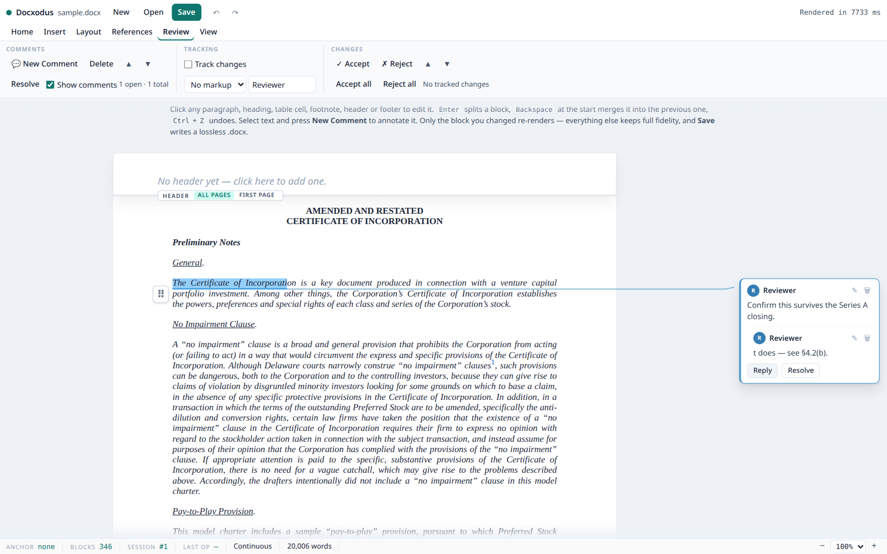
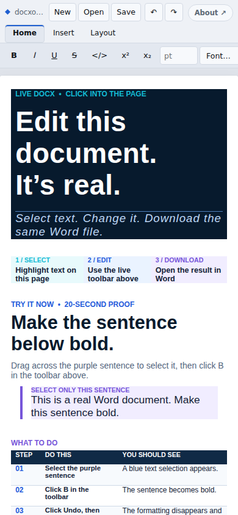

# The Editor Surface

What the in-browser editor exposes, what each control actually does, and what it costs.

This is the **UI reference**. For *why* the editor is built the way it is (Option B: the live
`DocxSession` is the model of record and the IR/anchor system is the addressing overlay), read
[`ir_editor_feasibility.md`](ir_editor_feasibility.md). For the underlying edit contract — anchor
lifecycle, error catalog, supported markdown subset — read
[`docx_mutation_api.md`](docx_mutation_api.md).

Three layers are described here, and they are not the same thing:

| Layer | Path | What it is |
|-------|------|------------|
| `DocxEditor` | `npm/src/editor.ts` (+ `editor-comments.ts`, `editor-headerfooter.ts`) | The framework-agnostic editor **engine**: the live `DocxSession`, block wiring, every command, the comment gutter and the header/footer region. Deliberately no chrome. A consumer who wants their own UI builds on this. |
| `mountRibbon` | `npm/src/ribbon.ts` (+ `ribbon-chrome.ts`) | The **surface**: Word's tab set, the status bar, the table picker, the find bar, the loading overlay, responsive layout. Shipped in the npm package; it is what the screenshots below show. |
| `createRibbonEditor` | `npm/src/embed.ts` | The one-call CDN form of the surface — boots WASM, scopes the document CSS, mounts the ribbon, narrates the wait. |

`mountRibbon` used to be three hand-written copies (`npm/examples/editor.html`, the GitHub Pages
landing page, the compact player), which drifted until the demo advertised a smaller editor than
the one that shipped. It now has one owner, and the hosts differ only in how they obtain the WASM
exports and how much chrome they turn on:

| Host | Obtains exports | Chrome |
|------|-----------------|--------|
| `npm/examples/editor.html` | boots `./_framework/dotnet.js` itself | full |
| `docs/demo/app.html` | `createRibbonEditor` from jsDelivr | `auto`, full-bleed |
| `docs/demo/index.html` | `createRibbonEditor` from jsDelivr | `auto`, inside the landing page's frame |
| `docs/demo/player.html` | `createRibbonEditor` from jsDelivr, on tap | pinned `compact`, no hint |

Every screenshot is the [NVCA Model Certificate of Incorporation](https://nvca.org/model-legal-documents/)
(234 body blocks, 94 footnote citations, 4 sections, 53 rendered pages) opened unmodified, captured by
`tools/screenshots/editor/capture.mjs` from the shipped surface.

Those are measurements, not targets, and they are now
`npm/tests/editor-paginated-charter.spec.ts` rather than a sentence — the page count sat at 48
here for a long time while the editor rendered something else, because nothing failed when prose
went stale (issue #688). Two things about that count are worth knowing before treating a change in
it as a regression. Pagination depends on font metrics, so the count is measured at a fixed viewport with
the fixture's own fonts. And the paginated editor does not fragment paragraphs across pages
(`fragmentParagraphs: false` in `mountPaginated`): a fragment has one addressable head, and the
editor's model is one addressable node per anchor, so a paragraph that does not fit moves whole.
On this document fragmentation is worth a single page, so it is not the lever behind a materially
different number.

The yardstick for what belongs here is *the ninety percent of Word people actually use*: the
Home tab's font and paragraph groups, styles, find and replace, tables, links and pictures,
page setup, comments, tracked changes, headers and footers. Rulers, columns, text boxes, shapes,
mail merge and macros are deliberately outside it.

---

## 1. Anatomy


Five regions, top to bottom:

1. **Title bar** — `New` / `Open` / `Save`, then `Undo` / `Redo`, and the status line. Never
   behind a tab; these are used constantly and hiding them costs more than the space they take.
2. **Tab strip** — `Home`, `Insert`, `Layout`, `References`, `Review`, `View`, plus two
   contextual tabs that exist only while the caret is inside a table (`Table`) or a header or
   footer story (`Header & Footer`). Entering a story selects its tab, as Word does; leaving it
   returns to `Home`.
3. **Ribbon panel** for the active tab, and — when open — the find & replace strip beneath it.
4. **Document** — the rendered DOCX, with the **comment gutter** to its right. Blocks are
   individually `contenteditable`; the page sheet is the body flow with the header and footer
   drawn as its top and bottom margins (§7).
5. **Status bar** — the anchor rail (§6), then Word's own cells: page position in page view,
   word count, and the zoom control.

A block shows a focus outline when it is the active edit target. In the shot above the caret is in
a body paragraph with a sub-range selected — note that the ribbon's **B** is lit, the size box
reads `10`, and the font-colour swatch matches the run, all derived from the selection rather than
from editor state.

---

## 2. Home


| Control | `DocxEditor` command | Session op |
|---------|---------------------|-----------|
| Font menu | `setFontFamily(name)` | `ApplyFormat` (`FontFamily` → `w:rFonts`) |
| Size box, A↑ / A↓ | `setFontSize(pts)`, `adjustFontSize(±1)` | `ApplyFormat` (`FontSizePts` → `w:sz`/`w:szCs`) |
| Clear formatting | `clearFormatting()` | `ApplyFormat` with every run property cleared |
| **B** / *I* / <u>U</u> / ~~S~~ / x² / x₂ / `</>` | `format(key)` | `ApplyFormat` |
| Small caps | `setSmallCaps(on)` | `ApplyFormat` (`SmallCaps` → `w:smallCaps`) |
| Font colour swatch | `setFontColor(hex)` | `ApplyFormat` (`Color` → `w:color`) |
| Highlight menu | `setHighlight(name)` | `ApplyFormat` (`Highlight` → `w:highlight`, Word's palette) |
| Bullets / Numbering / List style menu | `toggleList(kind)`, `setListFormat(kind)` | `GetListMembership`, then `ApplyListFormat` — the full gallery: `decimal`, `(1)`, `a.`, `(a)`, `A.`, `i.`, `(i)`, `I.` |
| Decrease / increase indent | `indent(±720)` | `SetParagraphFormat`, **or `SetListLevel` when the block is a list item** — outdent/indent on a list means "change level", which is what the user means and what Word does |
| Align left / center / right / justify | `setAlignment(a)` | `SetParagraphFormat` |
| Line spacing menu | `setLineSpacing(multiple)` | `SetParagraphFormat` (`LineSpacing` in 240ths, rule `auto`) |
| Style gallery | `setParagraphStyle(id)` | `SetParagraphStyle` |
| Delete block | `deleteBlock()` | `DeleteBlock` — inert inside a table and when it is the only editable block |
| Find / Replace | `find(query)`, `selectMatch`, `replaceMatch`, `replaceAll` | text scan over the rendered blocks; `ReplaceTextAtSpan` per replacement |

The font menu lists the families the open document actually uses first, then the fonts every
Word install has. The style gallery is read from the document (`ListStyles`: paragraph styles,
quick styles first, then by `uiPriority`) with the built-ins Word always offers added when the
document lacks them — the engine creates a missing built-in on first use.

The inline-format buttons apply to a **selected sub-range**, not the whole block, and every
paragraph-level command applies across a **multi-block selection**, reconciled as N single-block
swaps with the cross-block selection restored. A colour picker is a native control that takes
focus, so the engine bookmarks the last real selection and applies to that.

Keyboard: `Ctrl+B/I/U`, `Ctrl+Z`/`Ctrl+Shift+Z`, `Ctrl+E/L/R/J` (alignment), `Ctrl+[`/`Ctrl+]`
(font size), `Ctrl+K` (link), `Ctrl+F`/`Ctrl+H` (find / replace), `Ctrl+Alt+M` (new comment),
`Ctrl+Enter` (page break).

---

## 3. Insert


| Control | `DocxEditor` command | Session op |
|---------|---------------------|-----------|
| Page break | `pageBreakBefore(true)` | `SetParagraphFormat` |
| Table | `insertTable(rows, cols, opts)` | `InsertTable` |
| Picture | `insertImageFile(file)` → `insertImage(base64, opts)` | `InsertImage` at the caret offset |
| Link / Unlink | `insertHyperlink(url)`, `removeHyperlink()` | `AddHyperlink` on the selection span / `RemoveHyperlink` |
| Comment | `beginComment()` | opens a draft bubble (§4a) |
| Header / Footer | `goToHeaderFooter(which)` | puts the caret in the story (§7) |
| Page number menu | `insertPageNumber(field)` | `InsertPageNumberField` — `currentPage`, `totalPages`, or `pageOfTotal` ("Page X of Y") |
| Single / Thick / Double rule, Clear | `insertHorizontalRule(weight, style, position)`, `clearParagraphBorders()` | `InsertHorizontalRule` / `SetParagraphFormat` (`clearBorders`) |

**Table** opens a size picker rather than a text prompt:


Hover picks the dimensions; the footer carries cell alignment and a borderless toggle (borderless is
the default because a layout table is the common case in legal documents). **Link** opens a small
popover for the address, prefilled when the caret is already in a link.

A picture is inserted through a full re-render rather than a single-block swap: image parts are
not part of the block-render shell, so the block path would show the paragraph without its
picture.

---

## 4. Layout


| Control | `DocxEditor` command | Session op |
|---------|---------------------|-----------|
| Margins / Orientation / Size | `setPageSetup(op)` | `SetPageSetup` → `w:pgSz` / `w:pgMar` on the governing `w:sectPr` |
| Before / After | `setParagraphSpacing({beforePt, afterPt})` | `SetParagraphFormat` (`SpacingBefore`/`SpacingAfter`) |
| Special indent | `setFirstLineIndent(twips)`, `setHangingIndent(twips)` | `SetParagraphFormat` |
| Format / Start at / Clear | `setPageNumbering({format, start})`, `clearPageNumbering()` | `SetPageNumbering` / `ClearPageNumbering` → `w:pgNumType` |
| Page view / Headers & footers | `setPaginated(bool)` / re-open with `headerFooter` | render mode; edits survive |

Page setup and page numbering are **per section**, resolved from the section that owns the
caret's block; the note under the size menu states the section's current geometry. A margin or
size change remounts (the sheet's width is whole-document context).

---

## 4a. Review — comments



Comments render the way Word renders them. The converter marks a commented range inline
(`span.comment-highlight[data-comment-id]` around the runs, an editor-hidden `a.comment-marker`
at the reference), and `CommentGutter` (`npm/src/editor-comments.ts`) joins that to
`ListComments`: for every thread root it finds the highlight in the live DOM, places a bubble in
the gutter at the highlight's vertical position — stacking downward when threads would overlap,
in document order — and draws a leader line from the highlight to the bubble. Highlights and
bubbles are tinted per author; clicking either activates the thread.

| Control | `DocxEditor` command | Session op |
|---------|---------------------|-----------|
| New Comment | `beginComment()` → `addComment(text, author, target)` | `AddComment` (range markers + definition) |
| Reply (in the bubble) | `addCommentReply(root, text, author)` | `AddCommentReply` (`commentsExtended` threading) |
| Edit (in the bubble) | `updateComment(anchorId, text)` | `UpdateComment` |
| Resolve / Reopen | `setCommentResolved(anchorId, resolved)` | `SetCommentResolved` (`w15:done`) |
| Delete | `removeComment(anchorId)` | `RemoveComment` — a root takes its replies with it |
| Previous / Next | `stepComment(±1)` | — |
| Show comments | `showComments(bool)` | — (the markup stays in the document) |

"New Comment" opens a **draft bubble** beside the selection with a focused textarea; the target
block and span are captured at that moment, because typing into the bubble collapses the document
selection. Posting goes through `addComment`, which re-renders the host paragraph (the range
markers live inside it) and the gutter picks the new highlight up on its next layout. The gutter
re-lays out after every command, on resize and zoom, and on any DOM mutation in the document,
coalesced to one animation frame.

Nothing here is a second source of state: bubbles are re-derived from `listComments()` plus the
DOM on every pass, and a bubble whose highlight cannot be found (a comment on content the editor
does not render) is drawn dashed at the end of the column rather than dropped.

The engine side is a **comment-aware render profile**. The editor renders with comment mode
*Inline*; per-block re-renders go through `RenderEditorBlockHtml` / `RenderEditorBlocksHtml`,
whose shell carries the comments parts (and re-opens comment ranges that start in an earlier
paragraph), so a re-rendered commented paragraph keeps its highlight. `comments: false` on the
editor restores the markup-free render. In compact chrome the highlights stay and the bubbles
step aside — there is no room for a markup column on a phone — and "New Comment" falls back to a
prompt.

---

## 4b. Review — tracked changes

| Control | `DocxEditor` command | Session op |
|---------|---------------------|-----------|
| Track changes | `setTrackedChanges(mode)` | `SetTrackedChanges` — edits land as `w:ins`/`w:del` under `RenderInline` |
| Markup: All / None | `setTrackedChanges(RenderInline \| Accept)` | render profile |
| Author | `setRevisionAuthor(name)` | `SetRevisionAuthor` — also the comment author |
| Accept / Reject | `acceptRevision(id)`, `rejectRevision(id)` | `AcceptRevision` / `RejectRevision` on the change at the caret (`revisionAt(mark)` maps the rendered `ins`/`del` to the registry entry) |
| Accept all / Reject all | `acceptAllRevisions()`, `rejectAllRevisions()` | `AcceptAllRevisions` / `RejectAllRevisions` |
| Previous / Next change | `revisionElements()` | steps through the rendered marks |

Switching tracking mid-session keeps the undo history and the edits; the document re-renders so
revisions show (or stop showing) inline.

---

## 5. Table (contextual)


Appears only while the caret is inside a table; selecting away from the table hides it and falls back
to Home.

| Control | `DocxEditor` command | Session op |
|---------|---------------------|-----------|
| Insert above / below | `insertTableRow("above"\|"below")` | `InsertTableRow` |
| Insert left / right | `insertTableColumn("left"\|"right")` | `InsertTableColumn` |
| Delete row / column | `deleteTableRow()` / `deleteTableColumn()` | `DeleteTableRow` / `DeleteTableColumn` |
| Merge right / down, Split | `mergeCells(rowSpan, colSpan)`, `unmergeCells()` | `MergeCells` / `UnmergeCells` |
| Borders / No borders | `setTableBorders(spec)` | `SetTableBorders` |
| Shading swatch / No shading | `setCellShading(fill, scope)` | `SetCellShading` |
| Repeat header row | `setRepeatHeaderRow(bool)` | `SetRepeatHeaderRow` |
| Delete table | `deleteTable()` | `DeleteBlock` on the table anchor |

This replaced a **floating** table toolbar, whose absolute positioning had to be corrected twice — it
covered the first row, and then it covered the content below the table. A docked tab cannot overlap
the cell being edited, so the whole class of bug is gone by construction. The underlying session
ops are grid-aware, not rectangular-only: `w:gridSpan`, `w:gridBefore`/`w:gridAfter` and `w:vMerge`
runs are all handled — see the CRUD behavior table in [`docx_mutation_api.md`](docx_mutation_api.md).

---

## 6. The anchor rail (status bar)

```
ANCHOR  p:body:09612b1c13…   BLOCKS 346   SESSION #1   LAST OP  page format 651 ms   Page 3 of 48   4,120 words   − 100% +
```

| Cell | Meaning |
|------|---------|
| `anchor` | The focused block's `kind:scope:unid`. `kind` ∈ `p`/`h`/`li`; `scope` ∈ `body`/`hdr`/`ftr`/`fn`/`en` |
| `blocks` | Addressable blocks currently rendered |
| `session` | The live `DocxSession` handle in WASM |
| `last op` | The last command and how long it actually took |
| page / words | Word's own cells — the page holding the caret (page view) and the body word count |
| zoom | `setZoom(scale)`; fit-to-width still caps it on a narrow host |

The rail is not decoration. Anchor addressing *is* the architecture — every edit is routed by anchor,
not by DOM position — so the demo states the anchor rather than hiding it in devtools. It is also the
fastest way to confirm scope resolution is right: clicking a footnote body shows `p:fn:…`, a header
line shows `p:hdr:…`.

`last op` exists because operation cost here is not uniform (§9), and a surface that hides its repaint
cost invites you to design as if it were free — it is how the old six-second structural remount was
caught and driven down to a few hundred milliseconds.

---

## 7. Headers and footers


Header/footer stories live in their own OOXML parts outside the body, so they cannot be another
block in the body flow. `HeaderFooterRegion` (`npm/src/editor-headerfooter.ts`) presents them two
ways, both composed **per story paragraph** through the editor's own block renderer, which resolves
`hdr`/`ftr` anchors natively:

- **Continuous view** — two bands, drawn as the top and bottom margins of the sheet: a dashed rule
  and a small `Header` / `Footer` tag in the margin, the look Word has while a header is being
  edited. When more than one story kind exists the tag carries a switcher (`All pages` / `First
  page` / `Even pages`). A story inherited from an earlier section is labelled *Same as previous
  section*, since editing it edits the shared part.
- **Page view** — no bands. The paginator clones each story onto every page as inert
  presentation; **clicking a page's header or footer area swaps that page's clone for the live,
  editable story** (Word's edit-in-the-margin). A commit re-renders the paragraph and re-clones
  the story onto every other page showing the same story, substituting `PAGE` / `NUMPAGES` per
  page exactly as the paginator does, so all pages update without a remount. A story that grew
  past the band the paginator reserved re-paginates when the caret leaves it; one that did not
  leaves the page stack untouched.


Once rendered, a story paragraph is an ordinary editable block, wired by the same `wireBlock` as
the body — so the **entire ribbon works inside a story** with no story-specific command code — and
the caret entering one reveals the contextual tab:

| Control | `DocxEditor` command | Session op |
|---------|---------------------|-----------|
| Different first page | `setHeaderFooterKindEnabled("first", on)` | `SetHeaderFooterKindEnabled` → `w:titlePg` |
| Different odd & even pages | `setHeaderFooterKindEnabled("even", on)` | `SetHeaderFooterKindEnabled` → `w:evenAndOddHeaders` |
| Page number / Total pages / Page X of Y | `insertPageNumber(field)` | `InsertPageNumberField` (plain fields, so they follow the section's format) |
| Go to Header / Go to Footer | `goToHeaderFooter(which)` | — (page view creates the story and re-paginates when the document has none) |
| Close Header and Footer | `closeHeaderFooter()` | — |

Enabling either option seeds **both** the header and the footer story of that kind when they are
absent, as Word does: `w:titlePg` makes page 1 use its own header *and* footer, so seeding only
one side would silently leave page 1 with no footer. Disabling clears the flag and leaves the
parts in place, also as Word does. `w:evenAndOddHeaders` is document-global.

Stories keep exactly one live DOM node per paragraph at any time: the band's, or the one page
host that was clicked. The editor resolves a story block's anchor from its stamped
`data-hf-anchor` rather than the unid map, because empty story paragraphs in different parts
share a content-addressed unid.

---

## 8. Notes and pagination

Footnotes and endnotes render inline and are **ordinary editable blocks** — not opt-in, because they
are document content:


The citation marker and the `↩` backref are converter-generated chrome: they are excluded from the
content-offset space and are not editable. Without that, offsets drift, or the rendered display
number gets committed as literal text and destroys the citation run. The comment reference marker
is treated the same way.

`Page view` flows blocks into real page boxes, with notes at the foot of the page that cites them and
per-page number substitution. Page numbers are *computed per page*, not the field's cached result — a
header is authored once and cloned onto every page, so the cached value would read the same number
throughout.

---

## 8a. Page geometry: the column is the document's, the zoom is the view's

Both views lay the document out at ONE width — the text column its `w:sectPr` defines (page size
minus margins), which the converter stamps on every section wrapper (`data-content-width`,
`data-page-width`, the four margins) in **every** render mode. `DocumentViewport`
(`npm/src/viewport.ts`) applies it: each section wrapper gets the authored column plus the
authored margins as gutters, so `.docx-body-flow` measures exactly one page wide and *is* the
sheet the chrome paints.

A window narrower than that page is handled the way a word processor handles it — by zooming the
page to fit, never by reflowing the column:

| | continuous | paginated |
|---|---|---|
| Column width | section's `contentWidth` (pt) | page boxes, already page-sized by `pagination.ts` |
| Fit | zoom on `.docx-body-flow` | zoom on `#pagination-container` |
| Recomputed | `ResizeObserver` on the editor container | same |

`DocxEditor.zoom` reports the applied scale, `setZoom` pins one (the status bar's control), and
the viewport publishes the page's on-screen width as `--docx-sheet-width` so chrome docked
*outside* the zoomed sheet — the header/footer bands — lines up with it at any zoom.
`fitToWidth: false` opts out (an oversized page then overflows and the surface scrolls);
`columnWidth: "fluid"` restores the pre-geometry behavior of sizing the column from the host.

The comment gutter sits to the right of the sheet; the surface reserves its width
(`--dxr-gutter`, 264 px) so the page shifts left rather than the bubbles covering it — Word's
markup area.

---

## 9. What operations cost

Measured on a real document (`HC031-Complicated-Document.docx`, Chromium, WASM, warm) by
`npm/tests/editor-latency-bench.spec.ts` — the standing latency instrument; run it before and
after touching any hot path. Values are single-sample and machine-dependent; treat them as
ratios, not contracts:

| Operation | Cost | Before the 2026-08 latency pass | Why |
|-----------|------|--------------------------------|-----|
| Open + first render | ~3 s | ~3 s | Full document conversion (one-time; M3 worker offload is the open item) |
| Text edit (commit on blur) | ~30 ms | ~100 ms | Session op + single-block re-render through the persistent shell |
| Inline format (bold, size, colour) | ~35–50 ms | ~90–110 ms | Same, plus selection restore |
| Paragraph format (align, spacing) | ~40 ms | ~85 ms | Same |
| Enter (split) | ~40 ms | ~135 ms | Both halves render in ONE batched `RenderBlocksHtml` call |
| Backspace (merge) | ~25 ms | ~80 ms | Session op + one block render |
| Insert table / row, merge cells | ~85–130 ms | ~1.2–1.5 s (remount on real docs) | Incremental reconcile |
| Delete block | ~25 ms | ~1.2 s (remount on real docs) | Incremental reconcile |
| Add comment | ~80 ms | — | Host paragraph re-render + one gutter layout |
| Undo / redo | ~55–125 ms | ~1.1–1.2 s (remount on real docs) | Snapshot restore + incremental reconcile |
| `save()` | ~60–80 ms | ~60 ms | Lossless serialize |

The "before" column's structural-op numbers deserve a note: the incremental reconcile existed,
but on any document containing a block-level `w:sdt` (a TOC — i.e. most real documents) the
render plan missed the sdt's content blocks, the plan/DOM diff read as 100 % churn, and every
structural op silently fell back to the multi-second full remount. `ListBlocks` now flattens
`w:sdtContent` exactly as the renderer does, so the diff actually engages.

### The move surface

Block drag/reorder has its own instrument, `npm/tests/editor-move-latency-bench.spec.ts`, run
against `TestFiles/NVCA-Model-COI.docx` — 234 body blocks, **392 bookmarks**, 94 footnotes, 3
section breaks. The fixture is chosen, not incidental: the move guards are driven by cross-block
ranges and section breaks, and HC031's six bookmarks cannot exercise them at all.

| Operation | Cost | Before the 2026-08 move pass | Why |
|-----------|------|------------------------------|-----|
| Hover (pointer crosses a block) | ~8 ms | ~620 ms | Hover no longer asks the engine anything |
| Drag start / `ValidMoveTargets` | ~20–30 ms | ~4.3 s | One precomputed context per sweep, not per candidate |
| Move menu open | ~12 ms | ~4.4 s | Same query, plus memoization |
| Move a block (tracking off) | ~150 ms | ~780 ms | Incremental reconcile; undo restores the XML cache, not the package |
| Undo a move | ~165 ms | ~410 ms | Same |
| Move a block (review mode) | ~390–640 ms | ~8.4 s | Reconciles instead of remounting |

What made the move surface slow was not the move. `ValidMoveTargets` rebuilt the whole block
sequence and re-scanned the story for every marker pair, **per candidate and per side** — 2N
passes over the document, each materializing a member set per cross-block range — and the drag
UI called it (plus a re-registration of one drop listener per block) every time the pointer
crossed a paragraph boundary. On this charter that was seconds of work to move the mouse.

The guard now precomputes what is a property of the CONTAINER — block order, which blocks own a
section break (as a prefix sum), and each cross-block range as an index pair — once per sweep,
and answers each candidate with index arithmetic. `DocxSessionMoveBlockTests` pins the rewrite
against the original set-membership definition for every (source, target, side) triple, because
"faster" is only interesting if it decides identically. On the UI side, hovering consumes a
memoized answer and schedules the ask for idle time (so the handle withdraws from an immovable
block a beat later rather than the pointer paying for the query).

#### Drag feedback, and why drop position is geometry

The handle floats in the page MARGIN, 32 px left of the block's text column. So the natural
gesture — press it and pull straight down — keeps the pointer in the gutter, where it never
crosses a paragraph box. Resolving the drop target by asking which element the pointer is over
therefore found nothing for the entire gesture: no drop line, and a release that silently did
nothing. Drops only worked if the user happened to steer into the text.

There is now **one** drop target, on the document flow, and `DocxEditor.resolveDropAt` decides
where a release lands from the pointer's vertical position:

- every movable block is measured once at drag start (`captureDropZones`, ~1.4 ms on the
  charter; nothing reflows mid-drag, and scrolling — including drag autoscroll — moves the flow
  rigidly, which `dropZoneShift` corrects with one subtraction);
- the nearest block by vertical distance is the target, the half the pointer is in picks the
  side, snapped to the other side when only that one is legal;
- when neither side is legal — the pointer is in a region this block cannot reach, e.g. across a
  section break — there is no drop and nothing is drawn. Snapping to a distant legal boundary
  would move the block somewhere the user never pointed at.

Resolution costs **0.0 ms** per `dragover` on the charter, and the flow no longer carries one
registered drop listener per block (234 of them, re-registered at every drag start).

Three signals, each answering a different question:

| Signal | Answers | Mechanism |
|--------|---------|-----------|
| Source block dimmed to 38 % | *what* is moving | `.docx-block-drag-source`, added after the preview snapshot so the chip is not dimmed too |
| Preview chip naming the block | *what* is under the cursor | `setCustomNativeDragPreview`; the browser would otherwise ghost the 26 px grip |
| 2 px accent line with a leading dot | *where* it will land | `.docx-block-drop-indicator`, positioned by `transform` (no layout) with a one-shot 110 ms fade on each appearance |

The line is drawn at the MIDDLE of the gap between the two blocks (`dropEdgeY`), not on the
target's border-box edge: a paragraph's `w:spacing` becomes a CSS margin, which sits OUTSIDE the
box, so an edge-drawn line underlines the block's last line rather than reading as a boundary
between two blocks. At the ends of the flow there is no neighbour to bisect against, so half the
block's own margin stands in — the only place a computed style is read, and only for those two
blocks.

`editor-block-drag.spec.ts` drags down the gutter without ever entering the text column and
asserts all three, sampled per pointer step rather than only at the end. A second test pins the
line's POSITION on a document with real `w:spacing` — strictly inside the gap, on neither block's
edge, and clear of the last block past the end of the flow. That is a separate test on purpose:
every DOM-level assertion in the first one passes while the line is drawn in the wrong place,
because it is shown, is the right width, and tracks the pointer either way.

A review-mode move used to force a full remount, on the reasoning that the move-from/move-to
pair had to stay canonical. It does not: the render plan signs every unit with a content hash,
so the source — which keeps its unid while gaining the `w:moveFrom` wrapper — diffs as an
ordinary in-place substitution. Both bench and `editor-block-drag.spec.ts` assert
`lastReconcileFallback === null` after a tracked move, since a silent return to remounting would
show up only as a number.

Open on this document is ~10–12 s and is dominated by the full HTML conversion (~9 s of it),
which no part of this pass touches — see the M3 worker offload item.

Structural operations reconcile: `DocxEditor.reconcile()` diffs the DOM's top-level unit
sequence against the session's render plan (`ListBlocks` — LCS over `unid|contentHash` tokens),
keeps unchanged units' DOM nodes, renders changed/created units in one batched WASM call
(`RenderEditorBlocksHtml`, with real sibling context and true list-marker numbers), and renumbers
footnote/endnote marker chrome positionally from `ListNotes`. Substituted units pair by unid
first, positionally as fallback. A full remount survives as the universal **fallback** —
paginated mode, pure list-item insert/remove (sibling numbers shift without sibling XML
changing), border-`div` regrouping (`insertHorizontalRule`, `clearBorders`, list toggles), or
any inconsistency — so correctness never depends on the diff; the reconciled DOM is pinned
equal to a remounted DOM by `npm/tests/editor-reconcile.spec.ts`. When an op reads slow in the
rail, `editor['lastReconcileFallback']` says why it fell back.

Single-block re-renders go through a **persistent render shell**: the session keeps an open
throwaway document holding the formatting parts (and, since the comment gutter, the comments
parts), and each render replaces only its body (`HtmlConversionOps.RenderTargetsFromShell`), so
the package open, styles/numbering parse, and the converter's style-resolution caches are paid
once per formatting-signature change instead of per keystroke.

---

## 10. Driving the surface from tests

- Blocks are addressable in the DOM as `#editor [data-anchor]`; editable ones carry
  `contenteditable="true"`.
- `window.__demo` exposes `{ ribbon, exports, openDoc(bytes, name), getEditor() }` — and only once
  the engine is usable, so its appearance is the "surface is live" signal.
- `window.__selectTab(name)` activates a ribbon tab without pointer geometry; `window.__ribbon` is
  the `RibbonEditor` itself (`selectTab`, `setChrome`, `loader`, `open`, `destroy`).

**A control on a non-active tab is `display:none` and therefore not clickable.** A spec that touches
one must activate its tab first — `npm/tests/editor-demo-grid.spec.ts` calls `__selectTab('insert')`
before clicking `#table`.

Every control carries `data-dxr="<name>"`, and the surface *also* stamps `id = idPrefix + name`.
With no explicit `idPrefix` it uses bare ids when they are free on the page and generates
`dxr<N>-` the moment any of them is taken — so the historical spec selectors keep working and a
second ribbon on the same page cannot collide with the first. Stable ids the specs bind to:
`#editor`, `#fontsize`, `#new`, `#save`, `#undo`, `#redo`, `#table`, `#gridpicker`, `#gridcells`,
`#gridalign`, `#paginated`, `#loader`, `#comment`, `#commentresolve`, `#findtext`. Behavioural
attributes are the delegation contract: `data-cmd`, `data-align`, `data-indent`, `data-list`,
`data-tt`, `data-rev`, `data-hf`.

The comment gutter is addressable as `.docx-comment-gutter`, bubbles as
`.docx-comment-bubble[data-thread]` (with `data-comment-id`, `data-active`, `data-resolved`,
`data-draft`), and their actions as `[data-comment-action]`. Story hosts carry `data-hf-band`;
page-view header/footer areas carry `data-hf-page` before a click and `data-hf-active` while
edited.

The root reports its own state: `.dxr[data-state]` is `idle` | `loading` | `ready` | `error`, and
`.dxr[data-chrome]` is `full` | `compact`.

Serving the demo: `npm run build`, then copy `examples/editor.html` + the bundles into `dist/wasm/`
(this is what `pretest` does) and serve that directory. After a WASM rebuild, serve on a **new port** —
a warm browser blocks the new payload with an SRI integrity error that looks like a build failure.

---

## 11. Responsive behaviour



Density is measured from the **root element**, not the viewport, via a `ResizeObserver` — a narrow
embed inside a wide desktop page is narrow, and a viewport media query gets that wrong. Below
`compactBreakpoint` (default 720 px) the surface switches to `compact`:

| | `full` | `compact` |
|---|---|---|
| Ribbon panel | multi-row groups with labels | one horizontally-scrolling strip, labels dropped |
| Status bar / anchor rail | shown | hidden |
| Editing hint | shown | hidden |
| Title bar | brand + doc name + status | brand + doc name, status dropped |
| Comment gutter | beside the sheet | hidden (highlights stay; New Comment prompts) |
| Table picker | popover under its button | docked to the bottom edge, within thumb reach |
| Sheet padding | 56 px vertical | 22 px vertical (gutters come from `w:sectPr`, not from chrome) |
| Touch targets | 28 px | 40 px on every command control, by LAYOUT rather than pointer (an emulated narrow viewport reports a fine pointer and is still driven by a thumb). The rows add no padding of their own on top of it, and the tab strip — navigation, whose labels already clear the floor horizontally — takes 34 px, so three chrome rows cost 118 px rather than 140 px above the page. |

**Compact trims the chrome, never the page.** The document's text column is the width its
`w:sectPr` defines at every density; a window too narrow for it is handled by the viewport's
fit-to-width zoom (§8a), not by reflowing the column. A phone therefore shows a whole smaller
page rather than a narrower one whose lines break where Word's never would.

**No command is removed in compact** — the strip scrolls instead. That is the one rule the previous
hand-rolled mini toolbar broke, and the reason the compact player kept falling behind the editor.

A strip that scrolls must also *say so*: every scrolling strip (title bar, tab strip, panels, rail,
find bar) stamps `data-fade` with the edges that hide more content, and the stylesheet dissolves
content at exactly those edges — the horizontal twin of the document scroller's gradient veils.
Without it the clipped edge reads as a squashed layout, which is precisely how it was reported
from phones. The fade lifts the moment a strip fits, so nothing is faded unless there is more
behind it.

`chrome: "compact"` or `"full"` pins the density (what `player.html` does, since a host site may
size its iframe wide enough to trip the roomy layout); `"auto"` is the default.

Options the host controls: `chrome`, `compactBreakpoint`, `rail`, `fileActions`, `hint`, `loader`,
`documentName`, `idPrefix`, `onSave`, `onOpen`, `onStatus`, `onCommand`, plus every
`DocxEditorOptions` field (`comments`, `commentAuthor`, `headerFooter`, `trackedChanges`, …).

---

## 12. The loading overlay

Opening a document in the browser means streaming a trimmed .NET runtime. The wait is real, so the
surface spends it explaining what is being built rather than showing a spinner: a staged narrative
(engine → document → wiring → ready) with a progress bar, and a rotating capability card.

The overlay paints **before** any runtime exists, which is what lets a host that boots its own
runtime narrate the gap: `mountRibbon` returns immediately with `ribbon.loader`, and the host calls
`stage(n)` / `progress(pct, label)` / `done()` / `fail(err)` as it goes. `createRibbonEditor` drives
those four stages itself. `fail()` shows the error with a Retry button instead of leaving a dead
surface; `loader: false` removes the overlay entirely and every method becomes a no-op.

It covers the whole instrument, so half-built chrome never flashes, and drops `pointer-events` the
instant the fade starts — the surface underneath is already live by then.
