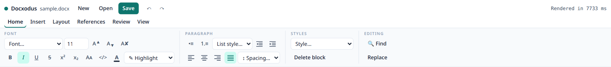
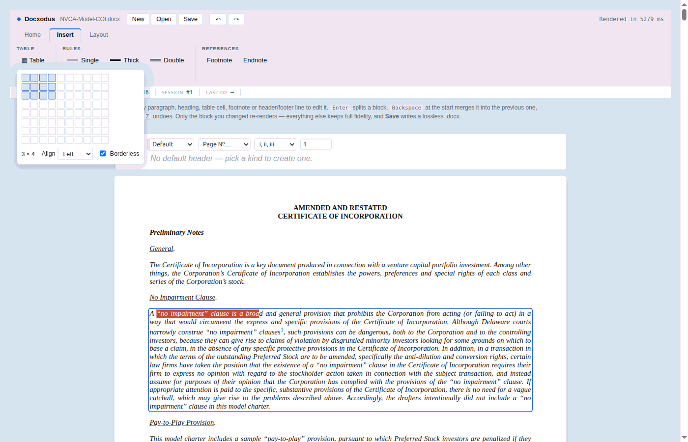
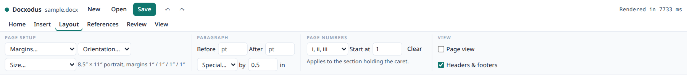
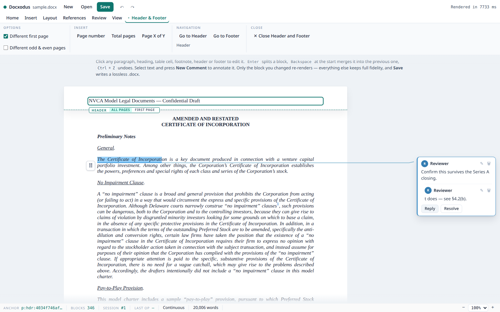
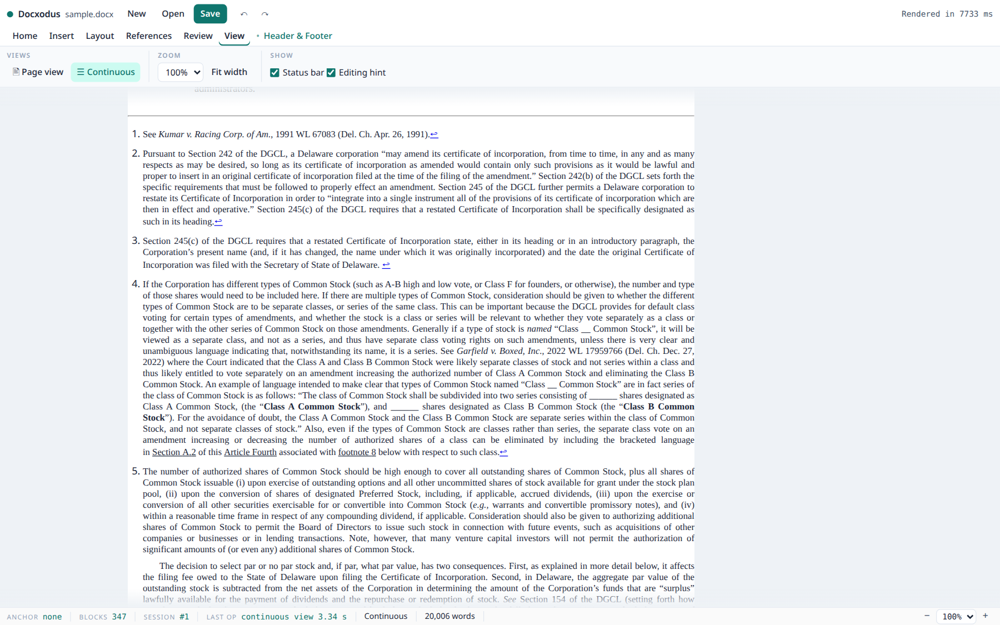
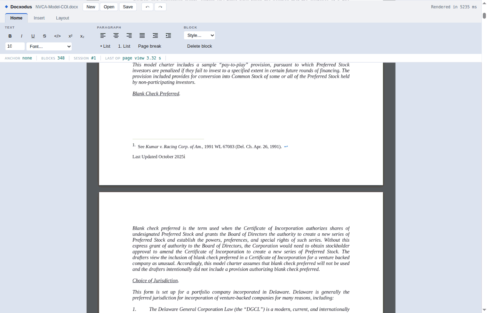

# The Editor Surface

What the in-browser editor exposes, what each control actually does, and what it costs.

This is the **UI reference**. For *why* the editor is built the way it is (Option B: the live
`DocxSession` is the model of record and the IR/anchor system is the addressing overlay), read
[`ir_editor_feasibility.md`](ir_editor_feasibility.md). For the underlying edit contract — anchor
lifecycle, error catalog, supported markdown subset — read
[`docx_mutation_api.md`](docx_mutation_api.md).

Two layers are described here, and they are not the same thing:

| Layer | Path | What it is |
|-------|------|------------|
| `DocxEditor` | `npm/src/editor.ts` | The framework-agnostic editor. **This is the product** — a consumer builds their own chrome on it. |
| The demo chrome | `npm/examples/editor.html` | A reference implementation of a ribbon over `DocxEditor`. Not shipped in the npm package; it is what the screenshots below show. |

Every screenshot is the [NVCA Model Certificate of Incorporation](https://nvca.org/model-legal-documents/)
(346 blocks, 94 footnote citations, 4 sections, 48 rendered pages) opened unmodified.

---

## 1. Anatomy


Four regions, top to bottom:

1. **Document strip** — `New` / `Open` / `Save`, then `Undo` / `Redo`. Never behind a tab; these are
   used constantly and hiding them costs more than the space they take.
2. **Tab strip** — `Home`, `Insert`, `Layout`, and a contextual `Table` tab that exists only while the
   caret is inside a table.
3. **Anchor rail** — live engine state (§6).
4. **Document** — the rendered DOCX. Blocks are individually `contenteditable`; the page sheet is the
   body flow, with header/footer bands docked around it (§4).

A block shows a focus outline when it is the active edit target. In the shot above the caret is in a
body paragraph with a sub-range selected — note that the ribbon's `I` is lit (the paragraph is
italic) and the size box reads `11`, both derived from the selection rather than from editor state.

---

## 2. Home



| Control | `DocxEditor` command | Session op |
|---------|---------------------|-----------|
| **B** / *I* / <u>U</u> / ~~S~~ / `</>` / x² / x₂ | `format(key)` | `ApplyFormat` |
| Size box | `setFontSize(pts)` | `ApplyFormat` (`FontSizePts` → `w:sz`/`w:szCs`) |
| Font dropdown | `setFontFamily(name)` | `ApplyFormat` (`FontFamily` → `w:rFonts`) |
| Align left / center / right / justify | `setAlignment(a)` | `SetParagraphFormat` |
| Decrease / increase indent | `indent(±720)` | `SetParagraphFormat`, **or `SetListLevel` when the block is a list item** — outdent/indent on a list means "change level", which is what the user means and what Word does |
| • List / 1. List | `toggleList(kind)` | `GetListMembership` to detect the current kind, then `ApplyListFormat` with `none` to toggle off |
| Page break | `pageBreakBefore(true)` | `SetParagraphFormat` |
| Style dropdown | `setParagraphStyle(id)` | `SetParagraphStyle` |
| Delete block | `deleteBlock()` | `DeleteBlock` — inert inside a table and when it is the only editable block |

The inline-format buttons apply to a **selected sub-range**, not the whole block, and every
paragraph-level command applies across a **multi-block selection**, reconciled as N single-block
swaps with the cross-block selection restored.

Size and font controls cache the last real selection, because a combobox steals focus when clicked —
without that cache a sub-range selection would be lost before the command ran.

---

## 3. Insert


| Control | `DocxEditor` command | Session op |
|---------|---------------------|-----------|
| Table | `insertTable(rows, cols, opts)` | `InsertTable` |
| Single / Thick / Double rule | `insertHorizontalRule(weight, style, position)` | `InsertHorizontalRule` (an empty bottom-bordered paragraph) |
| Below block / Above block | *(modifies the rule position argument)* | — |
| Clear | `clearParagraphBorders()` | `SetParagraphFormat` (`clearBorders`) |
| Footnote / Endnote | `insertFootnote(md?)` / `insertEndnote(md?)` | `InsertFootnote` / `InsertEndnote` |

**Table** opens a size picker rather than a text prompt:



Hover picks the dimensions; the footer carries cell alignment and a borderless toggle (borderless is
the default because a layout table is the common case in legal documents).

**Footnote / Endnote** cite a new note at the caret. Body blocks only — Word does not allow a note
reference inside a header/footer story or inside another note, so those are rejected client-side
rather than round-tripping to an `AnchorWrongKind`. The caret offset is captured *before* the block
is synced (syncing re-renders the block and would drop the live selection), so the citation lands
mid-word if that is where the caret was.

---

## 4. Layout



| Control | `DocxEditor` command | Session op |
|---------|---------------------|-----------|
| Page view | `setPaginated(bool)` | *(render mode; re-renders the live session, edits survive)* |
| Header & footer bands | *(re-opens with `headerFooter`)* | — |
| Format / Start at | `setPageNumbering({format, start})` | `SetPageNumbering` → `w:pgNumType` |
| Clear | `clearPageNumbering()` | `ClearPageNumbering` |
| Page number / Total pages | `insertPageNumber(field)` | `InsertPageNumberField` |

Page numbering is **per section**, resolved from the section that owns the caret's block. The same
setting is surfaced on both header/footer bands; all three read the live session, so changing it in
one place updates the others.

The field buttons live here rather than under Insert because the field lands in the **footer story**,
while every Insert control acts at the caret. Grouping them with the section's numbering keeps that
readable.

---

## 5. Table (contextual)


Appears only while the caret is inside a table; selecting away from the table hides it and falls back
to Home.

| Control | `DocxEditor` command | Session op |
|---------|---------------------|-----------|
| Insert above / below | `insertTableRow("above"\|"below")` | `InsertTableRow` |
| Insert left / right | `insertTableColumn("left"\|"right")` | `InsertTableColumn` |
| Delete row / column | `deleteTableRow()` / `deleteTableColumn()` | `DeleteTableRow` / `DeleteTableColumn` |

This replaced a **floating** table toolbar, whose absolute positioning had to be corrected twice — it
covered the first row, and then it covered the content below the table. A docked tab cannot overlap
the cell being edited, so the whole class of bug is gone by construction. Deleting the last row or
column removes the table. v1 assumes a rectangular grid (no `w:gridSpan`).

---

## 6. The anchor rail

```
ANCHOR  p:body:09612b1c13…   BLOCKS 346   SESSION #1   LAST OP  page format 651 ms
```

| Cell | Meaning |
|------|---------|
| `anchor` | The focused block's `kind:scope:unid`. `kind` ∈ `p`/`h`/`li`; `scope` ∈ `body`/`hdr`/`ftr`/`fn`/`en` |
| `blocks` | Addressable blocks currently rendered |
| `session` | The live `DocxSession` handle in WASM |
| `last op` | The last command and how long it actually took |

The rail is not decoration. Anchor addressing *is* the architecture — every edit is routed by anchor,
not by DOM position — so the demo states the anchor rather than hiding it in devtools. It is also the
fastest way to confirm scope resolution is right: clicking a footnote body shows `p:fn:…`, a header
line shows `p:hdr:…`.

`last op` exists because operation cost here is not uniform (§9), and a surface that hides its repaint
cost invites you to design as if it were free — it is how the old six-second structural remount was
caught and driven down to a few hundred milliseconds.

---

## 7. Header/footer bands



Opt-in (`headerFooter: true`). Header/footer stories live in their own OOXML parts outside the body,
so they dock as their own regions rather than joining the body flow.

Each band carries a `Default` / `First page` / `Even pages` kind selector, a page-number control, and
the section's page-number format/start. Band paragraphs are wired by the same code path as body
blocks, so **the entire ribbon works inside a band** with no band-specific command code.

The shot above shows the document's real first-page header after switching the kind to `First page`,
along with the inline warning the band raises: `w:titlePg` makes page 1 use its own first-page header
*and footer*, so an empty first-page footer silently leaves page 1 with no footer at all. A kind whose
story is inherited from an earlier section is shown, marked inherited, rather than offering to create
a redundant part.

Bands compose per story paragraph via the session-attached `RenderBlockHtml`, not from the body
render: the full render stamps anchors only in the main document part, and paginated mode clones one
header node onto every page — so a page-margin overlay could never be uniquely addressable.

---

## 8. Notes and pagination

Footnotes and endnotes render inline and are **ordinary editable blocks** — not opt-in, because they
are document content:



The citation marker and the `↩` backref are converter-generated chrome: they are excluded from the
content-offset space and are not editable. Without that, offsets drift, or the rendered display
number gets committed as literal text and destroys the citation run.

`Page view` flows blocks into real page boxes, with notes at the foot of the page that cites them and
per-page number substitution:



Page numbers here are *computed per page*, not the field's cached result — a header is authored once
and cloned onto every page, so the cached value would read the same number throughout. The footer
above shows `Last Updated October 2025 i` on page 1 of a section formatted `lowerRoman`.

---

## 9. What operations cost

Measured on a real document (`HC031-Complicated-Document.docx`, Chromium, WASM, warm) by
`npm/tests/editor-latency-bench.spec.ts` — the standing latency instrument; run it before and
after touching any hot path. Values are single-sample and machine-dependent; treat them as
ratios, not contracts:

| Operation | Cost | Before the 2026-08 latency pass | Why |
|-----------|------|--------------------------------|-----|
| Open + first render | ~3 s | ~3 s | Full document conversion (one-time; M3 worker offload is the open item) |
| Text edit (commit on blur) | ~30 ms | ~100 ms | Session op + single-block re-render through the persistent shell |
| Inline format (bold, size) | ~35–50 ms | ~90–110 ms | Same, plus selection restore |
| Paragraph format (align) | ~40 ms | ~85 ms | Same |
| Enter (split) | ~40 ms | ~135 ms | Both halves render in ONE batched `RenderBlocksHtml` call |
| Backspace (merge) | ~25 ms | ~80 ms | Session op + one block render |
| Insert table / row | ~85–130 ms | ~1.2–1.5 s (remount on real docs) | Incremental reconcile |
| Delete block | ~25 ms | ~1.2 s (remount on real docs) | Incremental reconcile |
| Undo / redo | ~55–125 ms | ~1.1–1.2 s (remount on real docs) | Snapshot restore + incremental reconcile |
| `save()` | ~60–80 ms | ~60 ms | Lossless serialize |

The "before" column's structural-op numbers deserve a note: the incremental reconcile existed,
but on any document containing a block-level `w:sdt` (a TOC — i.e. most real documents) the
render plan missed the sdt's content blocks, the plan/DOM diff read as 100 % churn, and every
structural op silently fell back to the multi-second full remount. `ListBlocks` now flattens
`w:sdtContent` exactly as the renderer does, so the diff actually engages.

Structural operations reconcile: `DocxEditor.reconcile()` diffs the DOM's top-level unit
sequence against the session's render plan (`ListBlocks` — LCS over `unid|contentHash` tokens),
keeps unchanged units' DOM nodes, renders changed/created units in one batched WASM call
(`RenderBlocksHtml`, with real sibling context and true list-marker numbers), and renumbers
footnote/endnote marker chrome positionally from `ListNotes`. Substituted units pair by unid
first, positionally as fallback. A full remount survives as the universal **fallback** —
paginated mode, pure list-item insert/remove (sibling numbers shift without sibling XML
changing), border-`div` regrouping (`insertHorizontalRule`, `clearBorders`, list toggles), or
any inconsistency — so correctness never depends on the diff; the reconciled DOM is pinned
equal to a remounted DOM by `npm/tests/editor-reconcile.spec.ts`. When an op reads slow in the
rail, `editor['lastReconcileFallback']` says why it fell back.

Single-block re-renders go through a **persistent render shell**: the session keeps an open
throwaway document holding the formatting parts, and each render replaces only its body
(`HtmlConversionOps.RenderTargetsFromShell`), so the package open, styles/numbering parse, and
the converter's style-resolution caches are paid once per formatting-signature change instead
of per keystroke.

---

## 10. Driving the surface from tests

- Blocks are addressable in the DOM as `#editor [data-anchor]`; editable ones carry
  `contenteditable="true"`.
- `window.__demo` exposes `{ exports, openDoc(bytes, name), getEditor() }`.
- `window.__selectTab(name)` activates a ribbon tab without pointer geometry.

**A control on a non-active tab is `display:none` and therefore not clickable.** A spec that touches
one must activate its tab first — `npm/tests/editor-demo-grid.spec.ts` calls `__selectTab('insert')`
before clicking `#table`. Stable ids the specs bind to: `#editor`, `#fontsize`, `#new`, `#table`,
`#gridpicker`, `#gridcells`, `#gridalign`.

Serving the demo: `npm run build`, then copy `examples/editor.html` + the bundles into `dist/wasm/`
(this is what `pretest` does) and serve that directory. After a WASM rebuild, serve on a **new port** —
a warm browser blocks the new payload with an SRI integrity error that looks like a build failure.
