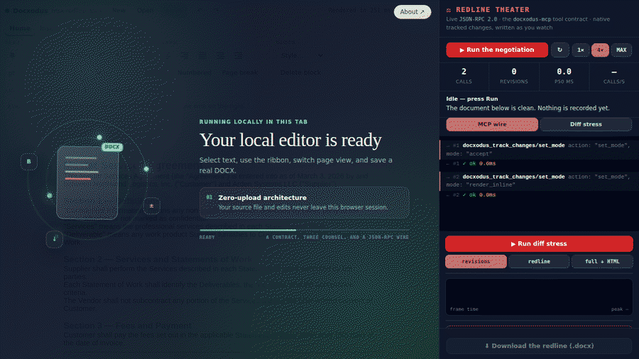
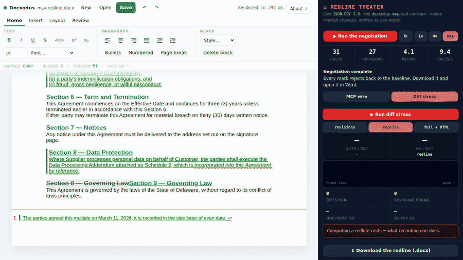

# GitHub Pages demo

Seven static pages, no application server. All host the **same** editor
surface — `createRibbonEditor` from the pinned `docxodus@10.0.0` embed bundle on
jsDelivr — and differ only in how much of the page belongs to the editor:

| Page | What it is |
|------|------------|
| `index.html` | The landing page. Hero, capability cards, the embed dialog, and a live demo inside its frame. This is the URL to share; its Open Graph metadata is what social platforms read. **Below 620px the frame mounts THE DOCX ARCADE instead of the plain editor** — same shipped surface, a game running on one of its paragraphs. A phone visitor is not going to draft a contract on a 390px screen, but they will play the thing, and it demonstrates the engine harder: a document rewritten and re-rendered ten times a second, still saving as a real `.docx`. The choice is taken in a `<head>` script, before first paint, so the copy framing the frame never advertises the demo the page did not mount; `?demo=editor` / `?demo=arcade` pin either on any screen, and the page links to the other one both ways. The nav links are a horizontal scroll strip on a phone rather than `display: none` — they point at the other demo pages, which is what a phone visitor most wants. |
| `app.html` | The editor full-bleed, nothing around it. The useful thing to open on a phone. |
| `player.html` | The compact iframe target, sized for ~480 × 480. Boots on tap so a feed iframe never streams a .NET runtime unasked, and pins the surface's compact layout. |
| `observatory.html` | The DOCX Observatory inside the live editor: procedural ASCII phenomena animated onto a Word paragraph in the editor's own session (`raw.replaceXml` + `editor.refresh()`). Pause — or click the water — and it is only a document: edit with the ribbon, Undo rewinds frame by frame, Save downloads the caught wave. The phenomena and frame loop are demo content, not library machinery: they live in `ascii-scenes.js` **in this directory** (also imported, via the test-webroot copy, by the two `npm/examples/ascii-animation*` pages), so `?engine=` pins the library alone and the scenes version with the site. Needs `DocxEditor.refresh()`, which 9.5.0 predates — it was pinned to `docxodus@9.6.0` ahead of that release and healed on its own when it published; it now shares the pin with its siblings. |
| `arcade.html` | THE DOCX ARCADE — the Observatory's interactive sequel: three playable games (a ¶-starring platformer, a Doom-style raycaster, and a REAL Doom-format level — Freedoom's E1M1, BSD-licensed, rasterized to the raycaster's grid) whose screen is the same per-frame `raw.replaceXml` + `editor.refresh()` paragraph, plus keyboard input both ways — WASD/arrows are claimed only while playing, and on resume the driver re-parses the game world FROM the document, so terrain typed into the paused screen (or letters typed into the raycaster's MAP panel) becomes real. The raycaster is a level-pack player: the hand-drawn 24×16 dungeon and the 126×109 Freedoom grid (generated by `tools/wad2cart.mjs` from `levels/e1m1.wad` in the Freedoom source tree, license notice retained in `freedoom-e1m1.js`) run the same renderer, controls, and map round-trip; maps bigger than the band scroll it as a player-following window. The games live in `ascii-arcade.js` in this directory (importing shared plumbing from `ascii-scenes.js`), same `?engine=` split as the Observatory, plus `?cart=quest\|dungeon\|e1m1` and `?intro=0` to skip the "OS LEGAL presents DOCXODUS" attract screen (the title card is drawn on the same canvas paragraph; Space drops the coin). Boots on tap when iframed. Its controls come from `arcade-dock.js` (below), which the landing page mounts identically. Specs: `npm/tests/demo-arcade.spec.ts` and `npm/tests/demo-arcade-freedoom.spec.ts` (the latter proves real play — a BFS autopilot steers the game's own input through the live document loop to the level's pickups, and `DOCXODUS_DOOM_MARATHON=1` runs the full-level completion). |
| `golf.html` | DOCX GOLF — course play on the editing surface itself, the inverse bet from the arcade: where the arcade painted frames INTO one paragraph through `raw.replaceXml` (the escape hatch), golf makes the real clubs the game. Six holes, each a start document loaded into the live ribbon editor and a target document built beside it; the referee is the comparison engine — a hole is CLEARED when `docxDiffGetRevisions` between your document and the target returns **zero revisions**, and the caddie panel phrases whatever revisions remain as the work left (`remove "Purchasr"`, `move "Governing Law"`, `reformat "Duties" (style)`). Holes escalate across the surface: a one-word fix, clause reordering, scoped defined-term conformance, heading styles (the Style dropdown is the club — the diff cares about `w:pStyle`, not just words), and a table hole (fix a cell, delete a duplicated row from the table toolbar), plus a footnote hole played with Insert → Footnote (the referee reads note parts too). On a phone the caddie collapses to its head strip behind a toggle, and a stuck player can concede with "Show me" — the caddie plays the content-addressed reference line and the scorecard marks the hole assisted. Strokes are counted from the document, not the toolbar: the driver fingerprints `session.save()` on a poll, so one committed burst of editing is one swing, and undo counts. Par/birdie/bogey scoring, a Target view, and a live redline view (`docxDiffCompare` → `convertDocxToHtml`) round out the caddie. The game lives in `docx-golf.js` in this directory (same `?engine=` split as its siblings); its pure logic is tested by `tools/docx-golf.test.mjs`, and `npm/tests/demo-golf.spec.ts` keeps the course honest the way the engine's own evals are kept honest — no hole starts solved, and every hole's content-addressed reference solution reaches zero revisions within par. Boots on tap when iframed. |
| `redline.html` | REDLINE THEATER — the agent-facing surface as the show. Three counsel negotiate a Master Services Agreement, and every edit you watch land is dispatched from a real JSON-RPC 2.0 `tools/call` frame in the shape `docxodus-mcp` accepts over stdio, streamed on a wire console beside the document. Nothing here renders a diff: the session runs in `render_inline` recording mode, so each call writes native `w:ins`/`w:del` into the live package and the editor repaints only the block that changed — what you are watching IS the file that downloads, and the three counsel are three values of the session's revision author, so it is genuinely per-reviewer. Ends by proving itself: `proveRedlineReversibility` plus a `docxDiffGetRevisions` pass confirm accept-all reaches the negotiated final and reject-all restores the baseline with **zero content differences**. One scripted call is *expected to be refused* — converting the carve-outs to a Word-native list has no reversible tracked-change encoding, so the engine declines it rather than writing a mark reject-all could not undo, and the wire shows that in amber. Speed is a display choice the HUD is honest about (1× / 4× / MAX, with measured p50 and calls/s); the run is ~3 s of wall clock at 4×, and the median tool call is under 6 ms. The show lives in `redline-theater.js` and the browser MCP endpoint in `mcp-wire.js`, both in this directory (same `?engine=` split as its siblings), plus `?speed=read\|brisk\|max` and `?autorun=1`. Specs: `npm/tests/demo-redline.spec.ts` (thirteen browser assertions across both modes, including the reversibility proof, the latency budget, and that a deeper diff pipeline actually costs more) and `docs/demo/tools/redline-theater.test.mjs`, whose contract test parses the real `tools/mcp-server/ToolCatalog.cs` so the demo's claim to speak the shipped tool contract is checked rather than asserted. |



### Diff stress: the other pipeline, and what it costs

The page has a second mode, and it exists because "redline" means two different
things in this codebase and only one of them was on screen. The negotiation
above **records** its redline — each MCP call writes `w:ins`/`w:del` into the
live package as it lands. **Diff stress** does the other thing: it recomputes
the redline from scratch after every single edit, baseline against current, and
times it, while each frame appends a clause so the input grows under the engine
instead of sitting at one fixed size that would measure nothing.



Three depths, because "how fast is the diff engine" has three honest answers:

| depth | engine calls | measured |
|---|---|---|
| `revisions` | `docxDiffGetRevisions` | ~5.4 diffs/s, p50 **184 ms** |
| `redline` | `docxDiffCompareProducts` → redline package + revisions | ~3.1 diffs/s, p50 **324 ms** |
| `full + HTML` | the above, then `convertDocxToHtml` with tracked changes | ~1.9 diffs/s, p50 **515 ms** |

Against a mutation costing ~2 ms through the same MCP endpoint, that is **74× to
283×**, and the panel reports the ratio it just measured rather than the one
written here. So the honest answer to "can we animate a diff per edit at 60fps"
is no, and was never going to be: a redline-per-edit loop lives between 2 and 6
frames per second on a document this size. That gap is the entire argument for
recording a redline when you are the one making the edits, and for computing one
when somebody hands you a document they changed. Both emit the same native
markup; the meter shows what each costs to get there.

The `redline` depth uses `docxDiffCompareProducts` rather than `docxDiffCompare`
followed by `docxDiffGetRevisions`, because one memoized alignment pass yielding
both products measured **268 ms against 337 ms** for the two calls separately —
about 20% saved, which is what that API is for.

The meter resets on every run: carrying frames across a depth change would report
a p50 describing neither pipeline. Switching back to the wire stops the loop, so
it cannot keep burning the engine behind a hidden pane.

### Why the frames are real, and where the resemblance stops

`tools/mcp-server` is a .NET process on stdio; a browser cannot subprocess it. So
`mcp-wire.js` reimplements the server's **front half** — envelope parsing, the
(tool, action) routing table, the MCP result shape (`content[].text` +
`isError`), and the convention that a business-level failure is a tool *result*
rather than a JSON-RPC error — over `DocxSession` via WASM instead of over a
pipe. The frames are the frames; the transport under them differs.

That claim is checked, not asserted:
`docs/demo/tools/redline-theater.test.mjs` parses the shipped `ToolCatalog.cs`
and fails if any (tool, action) pair the endpoint routes, any search `mode`, any
`set_mode` value, or any argument the script puts on the wire is absent from the
real catalog. It caught two mismatches while the demo was being written (a batch
argument named `atomic` that the catalog calls `mode`, and the `set_mode` wire
names needing to map to the `TrackedChangeMode` enum rather than being passed
through as strings).

What the endpoint deliberately does **not** reimplement: the document store and
its containment checks (a tab has no filesystem, so sessions are opened by the
host page rather than by `docxodus_open` with a path), the transaction/retry
journal, the delivery-bundle host, and the MCP Apps UI extension.

One thing the demo surfaces about the tool surface itself: attribution is a
session setting (`revisionAuthor`, taken at `docxodus_open`), so three counsel in
one session is a host-side switch with no tool behind it. The wire shows the two
`docxodus_track_changes/set_mode` calls that bracket the baseline build, but the
author changes between acts happen off-wire.

### The arcade's controls (`arcade-dock.js`)

Two pages host the arcade — the cabinet and, on a phone, the landing page — so
its controls live in one module rather than being hand-written twice, for the
same reason the editor surface itself ships from `npm/src/ribbon.ts`. Density is
measured from the controls' own host, not from a viewport media query: the
landing page frames the arcade inside a card, and a narrow card in a wide page
is narrow.

| | |
|---|---|
| **wide** | One bar under the document: cartridges, transport, pacing, embed, telemetry, hint. Unchanged from the cabinet's original dock. |
| **compact** | A slim HUD strip keeps the two controls you touch mid-game (play/pause and pacing); cartridges, restart, embed, telemetry and the hint move behind a `⋯` sheet. A thumb D-pad and a round **FIRE** button float over the bottom corners of the game. Nothing is dropped, only re-placed. |

`FIRE` sends `Space` — jump in the platformer, the weapon in the raycasters,
and the coin drop on the attract screen. The old touch row had no Space at all,
so Freedoom could be walked but never fought on a phone.

The pad is deliberately not a descendant of the editor root: the driver pauses
the game on any `pointerdown` inside the document ("the frame you clicked is now
an ordinary paragraph"), so a control living in there would pause on every tap.
Compact layout moves the nodes themselves rather than duplicating them into two
hidden layouts, so `startArcade` wires its listeners once and never learns that
layout exists. Specs: the phone-shaped controls in
`npm/tests/demo-arcade-mobile.spec.ts`, and the landing page's mobile default,
nav strip and floating controls in `npm/tests/social-demo.spec.ts`.

### The canvas font, and why the ASCII pages ship one

`fonts/docxodus-canvas-mono.woff2` (17 KB) is what keeps the Observatory's
phenomena and the Arcade's game screen on their grid.

Both draw into one Word paragraph as a 92 × 26 character grid, authored for
Courier New at 8pt. A grid holds only while every cell advances the same width
— and that is a property of the font the DEVICE resolves, which the document
has no way to state. The art draws with box drawing (`─ │ ┌`), block elements
(`█ ░ ▓`) and geometric shapes (`▶ ◀ ▲ ▼`); Android has no Courier New, and the
monospace face Chrome substitutes covers none of those, so each one lands in a
proportional fallback whose advance is not the cell. Every cell after it is
displaced — by a different amount on each row, because rows hold different
numbers of them. That is the tilt reported from the field: the title card's `X`
reading as a `K`, the logo smearing off the right edge, worst exactly where the
art is densest.

| Android's font coverage reproduced, canvas unpinned | the same frame, pinned |
|---|---|
|  |  |
|  |  |

Measured on a Pixel 5 rig with that font situation reproduced, as the spread
between the widest and narrowest row of the 92-cell grid: **12.1 cells** on the
attract screen and up to **23.0** in the cartridges, against **0.07 cells** worst
case with the pin — across both viewports, all three cartridges and all four
phenomena.

So `createCanvasPin()` in `ascii-scenes.js` pins the canvas paragraph to a font
we ship, rather than hoping the platform's fallback happens to match: a subset
of DejaVu Sans Mono whose every glyph advances 1233/2048 em, identical on every
device. It pins `white-space: pre` in the same rule (a row can never wrap —
see the CHANGELOG entry for that earlier fix) and neutralizes kerning,
ligatures and inherited letter/word spacing, which are per-glyph adjustments a
grid cannot survive either. The saved `.docx` is untouched and still says
Courier New: this is a display pin, and Word has the real font.

Rebuild it with `tools/build-canvas-font.sh`, which pins the source font by
SHA-256 and refuses any other — a font that is not single-advance would not
provide the guarantee. It writes the `.woff2` and the `.json` manifest that
`tools/canvas-font.test.mjs` reads: that test drives every scene, the whole
attract-screen sweep and all three cartridges, and fails if they can draw a
character the subset does not cover. `npm/tests/demo-arcade-mobile.spec.ts`
proves the rest on a phone-shaped rig with Android's font coverage reproduced.

Docxodus stays MIT-licensed. Only the font file carries the Bitstream Vera
Fonts license (`fonts/LICENSE.txt`), which permits the subset provided it is
renamed away from "Bitstream"/"Vera" — hence "Docxodus Canvas Mono". Like the
rest of this directory it is documentation-site content and is not part of the
`docxodus` npm package.

### Freedoom data provenance and license scope

Docxodus remains MIT-licensed. Only the derived `FREEDOOM_LEVEL` geometry and
monster-placement data in `freedoom-e1m1.js` carry Freedoom's BSD-3-Clause
terms; that generated file embeds the complete third-party notice and the
immutable source identifiers. The checked-in data exactly regenerates from:

- repository commit `d14dbbee3b6fbfb2c11cdb65eb61216e86d4ee85`;
- `levels/e1m1.wad`, Git blob `98d3dac0a2aaff8d1647fe6f8948742647a46de3`;
- WAD SHA-256 `d8acd8cf992f1f3af907634587f8a40765d6c43ac15adef1bfa29a2ff1b9e83d`.

Regenerate only with explicit provenance—the converter refuses to guess a
WAD's origin or license:

```sh
node tools/wad2cart.mjs /path/to/freedoom/levels/e1m1.wad E1M1 freedoom-e1m1.js \
  --cell=32 --source=freedoom \
  --source-ref=d14dbbee3b6fbfb2c11cdb65eb61216e86d4ee85 \
  --source-path=levels/e1m1.wad \
  --source-blob=98d3dac0a2aaff8d1647fe6f8948742647a46de3 \
  --source-sha256=d8acd8cf992f1f3af907634587f8a40765d6c43ac15adef1bfa29a2ff1b9e83d
```

The demo stays a documentation-site concern. Neither its runtime nor the
Freedoom-derived data is included in the `docxodus` npm tarball: the package
publishes an explicit allowlist of library JavaScript, declarations, and WASM
runtime files, and `npm run test:package-boundary` audits the actual packed
manifest after the Playwright webroot has been populated.

The surface itself is **not** written here — it ships in the npm package
(`npm/src/ribbon.ts`). These pages used to carry a hand-written toolbar each,
which drifted until the demo advertised a smaller editor than the one that
shipped. Changing the editor's UI means changing the module, not these files.

The sample document is the branded product guide in this directory; regenerate
it with `python tools/generate-demo-guide.py` from the repository root.

## Publish

1. Publish `docxodus@10.0.0` and confirm
   `https://cdn.jsdelivr.net/npm/docxodus@10.0.0/dist/embed.bundle.js` returns JavaScript.
2. In GitHub **Settings → Pages**, choose **GitHub Actions** as the publishing source.
   The `Deploy static demo to GitHub Pages` workflow uploads `/docs` without
   running Jekyll.
3. Open `https://jsv4.github.io/Docxodus/demo/` and verify the status chip becomes `Live`.
4. If the site is hosted anywhere else, update the absolute `og:url`, `og:image`,
   and `twitter:image` values in `index.html` and `app.html` before sharing.

All the pages accept query overrides for local or preview testing:

```text
?engine=<module URL of embed.bundle.js>&doc=<CORS-readable DOCX URL>
```

`app.html` also takes `?blank=1` to start from a new empty document.
`index.html` takes `?demo=arcade|editor` to pin which demo the frame mounts
(otherwise a phone gets the arcade and a desktop the editor), plus the arcade's
own `?cart=` and `?intro=0` when it is the one mounted.

## Social-platform expectations

- LinkedIn uses the landing page's Open Graph title, description, and image. It
  does not run the editor inside the feed; the user clicks through to the live page.
- X receives a `summary_large_image` link card. Its current developer docs no
  longer document historical Player Cards, so the page does not promise an
  interactive editor inside a post. `player.html` is for iframe-capable sites.
- The Playwright specs (`npm/tests/social-demo.spec.ts`) validate the static
  metadata, boot-on-tap behaviour, the live editor, and the responsive collapse —
  locally. They cannot prove how an external social client will render a post.
