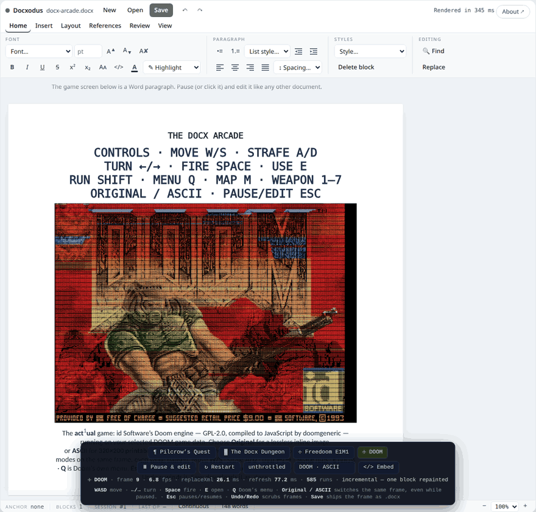

# GitHub Pages demo

Six static pages, no application server. All host the **same** editor
surface — `createRibbonEditor` from the pinned `docxodus@12.1.0` embed bundle on
jsDelivr — and differ only in how much of the page belongs to the editor:

| Page | What it is |
|------|------------|
| `index.html` | The landing page. Hero, capability cards, the embed dialog, and a live demo inside its frame. This is the URL to share; its Open Graph metadata is what social platforms read. **Below 620px the frame mounts THE DOCX ARCADE instead of the plain editor** — same shipped surface, a game running on one of its paragraphs. A phone visitor is not going to draft a contract on a 390px screen, but they will play the thing, and it demonstrates the engine harder: a document rewritten and re-rendered ten times a second, still saving as a real `.docx`. The choice is taken in a `<head>` script, before first paint, so the copy framing the frame never advertises the demo the page did not mount; `?demo=editor` / `?demo=arcade` pin either on any screen, and the page links to the other one both ways. The nav links are a horizontal scroll strip on a phone rather than `display: none` — they point at the other demo pages, which is what a phone visitor most wants. |
| `app.html` | The editor full-bleed, nothing around it. The useful thing to open on a phone. |
| `player.html` | The compact iframe target, sized for ~480 × 480. Boots on tap so a feed iframe never streams a .NET runtime unasked, and pins the surface's compact layout. |
| `observatory.html` | The DOCX Observatory inside the live editor: procedural ASCII phenomena animated onto a Word paragraph in the editor's own session (`raw.replaceXml` + `editor.refresh()`). Pause — or click the water — and it is only a document: edit with the ribbon, Undo rewinds frame by frame, Save downloads the caught wave. The phenomena and frame loop are demo content, not library machinery: they live in `ascii-scenes.js` **in this directory** (also imported, via the test-webroot copy, by the two `npm/examples/ascii-animation*` pages), so `?engine=` pins the library alone and the scenes version with the site. Needs `DocxEditor.refresh()`, which 9.5.0 predates — it was pinned to `docxodus@9.6.0` ahead of that release and healed on its own when it published; it now shares the pin with its siblings. |
| `arcade.html` | THE DOCX ARCADE — four playable games rendered through the editor’s ordinary document API. DOOM can show its native 320×200 image or project the same framebuffer into 64,000 colored printable ASCII cells in one Word paragraph. The dock’s **Original / ASCII** selector works while playing or paused. Copy/paste, undo/redo, and save/reopen preserve the displayed frame. The default game data is Freedoom; the original DOOM showcase below uses a locally hosted original shareware IWAD. |
| `golf.html` | DOCX GOLF — course play on the editing surface itself, the inverse bet from the arcade: where the arcade painted frames INTO one paragraph through `raw.replaceXml` (the escape hatch), golf makes the real clubs the game. Six holes, each a start document loaded into the live ribbon editor and a target document built beside it; the referee is the comparison engine — a hole is CLEARED when `docxDiffGetRevisions` between your document and the target returns **zero revisions**, and the caddie panel phrases whatever revisions remain as the work left (`remove "Purchasr"`, `move "Governing Law"`, `reformat "Duties" (style)`). Holes escalate across the surface: a one-word fix, clause reordering, scoped defined-term conformance, heading styles (the Style dropdown is the club — the diff cares about `w:pStyle`, not just words), and a table hole (fix a cell, delete a duplicated row from the table toolbar), plus a footnote hole played with Insert → Footnote (the referee reads note parts too). On a phone the caddie collapses to its head strip behind a toggle, and a stuck player can concede with "Show me" — the caddie plays the content-addressed reference line and the scorecard marks the hole assisted. Strokes are counted from the document, not the toolbar: the driver fingerprints `session.save()` on a poll, so one committed burst of editing is one swing, and undo counts. Par/birdie/bogey scoring, a Target view, and a live redline view (`docxDiffCompare` → `convertDocxToHtml`) round out the caddie. The game lives in `docx-golf.js` in this directory (same `?engine=` split as its siblings); its pure logic is tested by `tools/docx-golf.test.mjs`, and `npm/tests/demo-golf.spec.ts` keeps the course honest the way the engine's own evals are kept honest — no hole starts solved, and every hole's content-addressed reference solution reaches zero revisions within par. Boots on tap when iframed. |

### Original DOOM, rendered as ASCII in the editor

The [GIF](../images/arcade-doom-ascii.gif) and [MP4](../images/arcade-doom-ascii.mp4)
show the original DOOM title screen, New Game / episode / difficulty selection,
and initial E1M1 movement and firing. This is a real-time browser recording of
the actual editing surface. Its timestamps are preserved; the GIF is encoded at
8 FPS and 880×840, with the MP4 retaining the full 1100×1050 browser view.
The measured gameplay rate and input-asset digests are recorded in
[`arcade-doom-ascii-capture.json`](../images/arcade-doom-ascii-capture.json).
The recording opens the menu directly from the title screen.

<p align="center">
  
</p>

Still captures: [title](../images/arcade-doom-ascii-title.png),
[menu](../images/arcade-doom-ascii-menu.png),
[gameplay in the editor](../images/arcade-doom-ascii-gameplay.png),
[complete frame](../images/arcade-doom-ascii-frame.png), and
[weapon and HUD detail](../images/arcade-doom-ascii-detail.png).
The [saved DOCX](../images/arcade-doom-ascii-frame.docx) contains the paused
ASCII frame as editable colored text. The earlier
[native-image walkthrough](../images/arcade-doom.gif) uses Freedoom game data.

Select **DOOM · ASCII** in the dock, or start with `?cart=doom&render=ascii`.
On a phone the renderer selector lives in the **⋯** controls sheet.
**Original** selects the image renderer; the IWAD selects which game's artwork
and levels are played. The original shareware capture uses
`&wad=./vendor/doom1.wad.gz`; the default remains Freedoom.

Each of the 320×200 source pixels contributes one printable ASCII glyph,
including the complete status bar. A measured glyph-coverage ramp carries tone;
a 19-ink palette, including saturated primaries, carries hue. Coverage is
calibrated in packed rows at the actual document font size so dark outlines
retain their contrast. The selected glyphs fit within a row and have similar
measured coverage at DPR 1 and 2. Taller glyphs previously bled into adjacent
rows, mixing foreground and background colors; screenshot regressions now
check that neighboring saturated rows stay separate. Adjacent color runs are merged toward a 700-segment
target, with a per-cell color-error bound: complex pictures can exceed the
target rather than lose contrasting strokes. There are no per-cell backgrounds,
block/Braille glyphs, or separately reconstructed HUD labels. Each row also has a printable
`|` guard for safe paragraph editing: 321×200 = **64,200 document characters**,
with 199 line breaks, 2pt bold monospaced text, 0.2pt character spacing, and exact
1.7pt line spacing. The tighter color-error bound also preserves small red
strokes against orange backgrounds.

To measure the authored ramp in the browser, run
`DPR=1 node docs/demo/tools/calibrate-ascii.mjs` from the repository root with
the staged demo served on port 8082, then repeat with `DPR=2`. The optional
`--all` flag measures all 95 printable glyphs. Normalize to the densest eligible
glyph at each density; exclude ink outside the baseline/cap-height band and
glyphs whose normalized coverage differs by more than five percentage points.
The authored table averages the remaining measurements.

The [raw menu source](../images/arcade-doom-ascii-menu-source.png) shows that
original DOOM draws its menu over the title artwork, including the large
background logo and smaller menu logo. The projection preserves that source
composition; it does not hide the title art or detect menu states.

The library improvements are independent of the cartridge: repeated-format,
fixed-line ASCII paragraphs can resolve each distinct format once during an
incremental render, then expand every original character and break. Unsupported
structures use the ordinary converter. Batched random anchor IDs and indexed
anchor lookup reduce work for any large XML replacement; negative Word character
spacing now renders correctly. The document's authoritative OOXML is never
abbreviated. Native tests compare incremental output with a full saved-document
render, and browser tests verify same-frame toggles, save/reopen, copy/paste of
an undo-scrubbed frame, gameplay input, and phone layout.

**Release status:** the static pages still pin `docxodus@12.1.0`. These captures
use the locally built `?engine=./embed.bundle.js`, which includes the new general
renderer improvements and authored character spacing. Publish a library release
and update the shared demo pin before expecting the same ASCII geometry and
throughput from the default CDN-backed page.

To reproduce the original DOOM capture (from `npm/`):

```bash
npm run build
npm run pretest
node scripts/fetch-doom-iwad.mjs --shareware
python3 -m http.server 8082 --directory dist/wasm
# In another terminal, with ffmpeg on PATH:
npm run capture:doom-ascii
```

`ARCADE_URL` overrides the local origin, `FFMPEG` can point to an executable,
and `DOOM_ENGINE_PATH` can mirror the exact pinned engine for offline captures
(the script verifies its SHA-256). The optional `--preview` flag captures only
the title PNG. The engine and IWAD stay in local caches, outside the repository
and npm package. See [asset provenance](vendor/NOTICE.md).

### The arcade's controls (`arcade-dock.js`)

Two pages host the arcade — the cabinet and, on a phone, the landing page — so
its controls live in one module rather than being hand-written twice, for the
same reason the editor surface itself ships from `npm/src/ribbon.ts`. Density is
measured from the controls' own host, not from a viewport media query: the
landing page frames the arcade inside a card, and a narrow card in a wide page
is narrow.

| | |
|---|---|
| **wide** | One bar under the document: cartridges, transport, pacing, embed, telemetry, hint. Unchanged from the cabinet's original dock. |
| **compact** | A slim HUD strip keeps the two controls you touch mid-game (play/pause and pacing); cartridges, restart, embed, telemetry and the hint move behind a `⋯` sheet. A thumb D-pad and an action cluster float over the bottom corners of the game. Nothing is dropped, only re-placed. |

`FIRE` sends `Space` — jump in the platformer, the weapon in the raycasters and
in Doom, and the coin drop on the attract screen. The old touch row had no
Space at all, so the shooters could be walked but never fought on a phone.

**What the pad offers is the cartridge's call.** Each cartridge declares a touch
profile beside the keyboard map it mirrors (`cart.touch`), and the dock fills
its fixed slots from it through `setPad` — geometry here, control map there:

| cartridge | pad |
|---|---|
| ¶ Pilcrow's Quest | walk `←/→`, `▲` and a round **JUMP** |
| ▓ Dungeon · ☩ Freedoom E1M1 | forward/back, turn (`↺ ↻`), strafe (`◀ ▶`), **FIRE**, **RUN** |
| ☩ DOOM | all of the above plus **USE**, and a **KEYS** tray: weapons 1–7, **MAP**, **MENU**, `⏎` |
| attract screen | one round **START** — nothing on a title card is steerable |

Turning rotates and strafing translates, so the two pairs of side buttons never
wear the same arrow. `RUN` latches rather than asking to be held — on a phone
that hand is steering. A slot the cartridge does not use is hidden *and* loses
its `data-code`, so a button can never send a key the cartridge ignores; the
driver wires the pad by delegation and reads each button's code at press time,
which is what lets one set of buttons follow the cartridge. Presses are tracked
per pointer, so firing with one thumb while turning with the other releases only
the key that came up, and pausing releases everything the pad holds.

This is the gap the pad's first version left: movement and fire are the whole
control map of the platformer and about half of a Doom-format level's. On a
touch screen Doom could be walked as far as E1M1's first door and no further —
a door is a key press (`E`), and a phone had no key to press. The headless
checks in `tools/ascii-arcade.test.mjs` hold every profile to the keyboard map
beside it, including that a thumb can reach every function Doom gives a
keyboard.

Doom's complete keyboard map also appears immediately above the framebuffer as
four centered 18pt document paragraphs. Each line is deliberately short enough
for the fixed document column; one oversized run can clip instead of reflowing
in a fixed-layout viewer. At the fitted desktop page the controls compute to
24px, and the browser guard still requires at least 14px after a 60% embed
scale. The context fence keeps all four static paragraphs out of every frame
conversion.

The pad is deliberately not a descendant of the editor root: the driver pauses
the game on any `pointerdown` inside the document ("the frame you clicked is now
an ordinary paragraph"), so a control living in there would pause on every tap.
Compact layout moves the nodes themselves rather than duplicating them into two
hidden layouts, so `startArcade` wires its listeners once and never learns that
layout exists. Specs: the phone-shaped controls in
`npm/tests/demo-arcade-mobile.spec.ts`, and the landing page's mobile default,
nav strip and floating controls in `npm/tests/social-demo.spec.ts`.

### The canvas font, and why the ASCII pages ship one

`fonts/docxodus-canvas-mono.woff2` (17 KB) is what keeps the Observatory's
phenomena and the Arcade's game screen on their grid.

The Observatory, opener, and first three cartridges draw into one Word paragraph
as a 92 × 26 character grid authored for Courier New. Doom uses a native image
and does not depend on glyph metrics. A text grid holds only while
every cell advances the same width
— and that is a property of the font the DEVICE resolves, which the document
has no way to state. The art draws with box drawing (`─ │ ┌`), block elements
(`█ ░ ▓`) and geometric shapes (`▶ ◀ ▲ ▼`); Android has no Courier New, and the
monospace face Chrome substitutes covers none of those, so each one lands in a
proportional fallback whose advance is not the cell. Every cell after it is
displaced — by a different amount on each row, because rows hold different
numbers of them. That is the tilt reported from the field: the title card's `X`
reading as a `K`, the logo smearing off the right edge, worst exactly where the
art is densest.

| Android's font coverage reproduced, canvas unpinned | the same frame, pinned |
|---|---|
|  |  |
|  |  |

Measured on a Pixel 5 rig with that font situation reproduced, as the spread
between the widest and narrowest row of the 92-cell grid: **12.1 cells** on the
attract screen and up to **23.0** in the text cartridges, against **0.07 cells**
worst case with the pin — across both viewports, the text cartridges and all
four phenomena. The mobile Doom check instead pins its exact 320 × 200 image geometry.

So `createCanvasPin()` in `ascii-scenes.js` pins the canvas paragraph to a font
we ship, rather than hoping the platform's fallback happens to match: a subset
of DejaVu Sans Mono whose every glyph advances 1233/2048 em, identical on every
device. It pins `white-space: pre` in the same rule (a row can never wrap —
see the CHANGELOG entry for that earlier fix) and neutralizes kerning,
ligatures and inherited letter/word spacing, which are per-glyph adjustments a
grid cannot survive either. The saved `.docx` is untouched and still says
Courier New: this is a display pin, and Word has the real font.

Rebuild it with `tools/build-canvas-font.sh`, which pins the source font by
SHA-256 and refuses any other — a font that is not single-advance would not
provide the guarantee. It writes the `.woff2` and the `.json` manifest that
`tools/canvas-font.test.mjs` reads: that test drives every scene, the whole
attract-screen sweep and every cartridge, and fails if they can draw a
character the subset does not cover. `npm/tests/demo-arcade-mobile.spec.ts`
proves the rest on a phone-shaped rig with Android's font coverage reproduced.

Docxodus stays MIT-licensed. Only the font file carries the Bitstream Vera
Fonts license (`fonts/LICENSE.txt`), which permits the subset provided it is
renamed away from "Bitstream"/"Vera" — hence "Docxodus Canvas Mono". Like the
rest of this directory it is documentation-site content and is not part of the
`docxodus` npm package.

### Doom, and what it does to the licensing

Cartridge 4 is the actual game. `doom-cart.js` drives
[doomgeneric](https://github.com/grubbyplaya/doomgenericjs) — id Software's
Doom source, GPL-2.0, compiled to JavaScript — on Freedoom's BSD-licensed
IWAD. It writes its complete 320×200 framebuffer into one inline image or
projects it into colored ASCII runs in the screen paragraph every frame.

**Neither the engine nor the IWAD is in this repository.** They are 13 MB of
binary that would show up in every clone forever and never diff usefully, so
both are pinned jsDelivr URLs instead — by 40-hex commit for the engine, by tag
for the IWAD, both served with `access-control-allow-origin: *` and cached
immutably. Upstream commits, SHA-256s, license texts and verification commands
are in [`vendor/NOTICE.md`](vendor/NOTICE.md), along with what the IWAD's
sibling repository has to contain and why it needs to exist at all (GitHub
serves release assets without CORS, so a browser cannot fetch Freedoom's
release directly).

The Playwright specs do not touch the CDN for game data:
`npm/scripts/fetch-doom-iwad.mjs` pulls the release asset server-side, verifies
its digest, and drops a gzipped copy into the test webroot for the specs to
load same-origin.

**This is the one place the repository is not MIT.** `doom-cart.js` is combined
with a GPL engine at runtime, so that single file is offered under
GPL-2.0-or-later and says so in its header. Everything else — `ascii-arcade.js`
included, which imports it — stays MIT, which is GPL-compatible: each file
remains separately available under its own terms, and only the combination a
browser assembles when the Doom cartridge is selected is GPL-2.0.

The engine is behind a dynamic `import()` inside `doom-cart.js`, so a visitor
who plays the platformer or the dungeon fetches neither. `?wad=` points the
cartridge at a **same-origin** IWAD you host yourself and are licensed to play
(a retail `doom.wad` works), and `?sound=0` boots it mute.

### Native-image rendering

In Original rendering mode, each engine frame is
encoded losslessly as PNG and passed to `DocxSession.replaceImage`; that replaces the package media
payload referenced by the existing `w:drawing`. `DocxEditor.refresh()` then performs the same
single-block OOXML→HTML conversion and DOM reconciliation used after any other session edit. The
editor contains one `` and no game canvas.

The acceptance test is deliberately about the displayed document, not optimistic source data:
the image must decode at exactly 320 × 200, sample pixel-for-pixel against doomgeneric's BGRA
framebuffer, retain a chromatic palette, fill at least 590 × 440 CSS pixels in the fitted page,
and make the HUD and its numerals at least 70 and 24 CSS pixels high respectively. Those guards
make unreadable grayscale, quantized and tiny-screen regressions fail even if they are fast.

### Where the ten visible FPS comes from

The expensive unit is a completed image mutation plus OOXML→HTML refresh, image decode, and
browser presentation—not a Doom tic. The driver therefore does not schedule the next replacement
until the current data-URI image is decoded and at least one `requestAnimationFrame` boundary has
passed. This prevents a fast producer from claiming frames the player never saw.

On the live browser path, the integrated five-second turning sample completed **78 document
frames in 5.02 seconds (15.53 FPS)** and observed **79 distinct decoded image sources on animation
frames (15.73 visible FPS)**, with approximately 17.7ms mutation and 28.8ms refresh time. The
browser spec repeats the measurement while holding a real turn key and requires both rates to
remain at or above 9.5 FPS. It separately proves that the view moves, the HUD stays fixed, and
keyboard input reaches the real engine.

Incremental image rendering needed one general library repair: the isolated render shell now
copies each embedded image relationship and supplies the normal base64 image handler. A focused
image-session regression calls `renderBlock()` after insertion and proves it returns a valid data
PNG and alt text. The full .NET and browser suites remain the guard against collateral library
regressions.

### The screen is fenced away from the caption

A single-block re-render does not render the block alone. The engine pads each
target with **one real neighbour on each side** before converting it, so that
`w:contextualSpacing` resolves exactly as it would in a full render; those
context clones are discarded once the target's HTML is extracted. That is
correct, and cheap — unless a neighbour is large.

The screen's lower neighbour was the caption: a formatted prose paragraph of 36
runs carrying a footnote reference, converted in full on every frame of every
game purely as context, then thrown away. Fencing the screen with two
one-character paragraphs moves it out of that slot, measured **7.4 → 8.8
repaints a second** and A/B'd inside one browser process so the container's
drift could not be mistaken for the change.

The fence has to be the boundary of the litter sweep too. `syncFromDocument`
deletes stray paragraphs between the screen and the caption, so that pausing to
edit cannot slowly fill the document with Enter-splits — and on the first
attempt it dutifully deleted the fence on the first pause. It now sweeps up to
the fence rather than past it.

The native image keeps that contextual saving while giving the framebuffer the
whole document column. Controls stay outside the hot block as four real 18pt
paragraphs, so neither their conversion cost nor tiny framebuffer text can
compromise play. Both rendering modes save as a `.docx` without a mode switch.

There is deliberately no engine override. `import()` executes whatever it
fetches, on this page's origin and with its privileges, so a URL parameter
naming the module would be remote code execution from a crafted link rather
than a knob. The cartridge's URL gate allows exactly its own pin plus
same-origin, and nothing else.

The demo stays a documentation-site concern. Neither its runtime nor the Doom
cartridge's third-party dependencies are included in the `docxodus` npm
tarball: the package
publishes an explicit allowlist of library JavaScript, declarations, and WASM
runtime files, and `npm run test:package-boundary` audits the actual packed
manifest after the Playwright webroot has been populated.

The surface itself is **not** written here — it ships in the npm package
(`npm/src/ribbon.ts`). These pages used to carry a hand-written toolbar each,
which drifted until the demo advertised a smaller editor than the one that
shipped. Changing the editor's UI means changing the module, not these files.

The sample document is the branded product guide in this directory; regenerate
it with `python tools/generate-demo-guide.py` from the repository root.

## Publish

The pages load the library from jsDelivr at an exact version, so the pin can
only move *after* npm publishes and the CDN serves it. Move every pin in one
change — the pages, this README, `docs/npm-package.md`, `npm/README.md`,
`npm/examples/embed.html`, and `RELEASE_ENGINE` in
`npm/tests/social-demo.spec.ts` — and `tools/engine-pin.test.mjs` (run by
`npm run test:demo-logic`, and so by every Playwright run) fails if one of them
is left behind, if the version drops below the arcade's
`IMAGE_ENGINE_MINIMUM`, or, under `DOCXODUS_CHECK_CDN=1`, if the CDN does not
serve it yet. That guard exists because a stale pin is invisible to the browser
specs: every one of them overrides `?engine=` to the locally built bundle.

1. Publish `docxodus@12.1.0` and confirm
   `https://cdn.jsdelivr.net/npm/docxodus@12.1.0/dist/embed.bundle.js` returns JavaScript.
2. In GitHub **Settings → Pages**, choose **GitHub Actions** as the publishing source.
   The `Deploy static demo to GitHub Pages` workflow uploads `/docs` without
   running Jekyll.
3. Open `https://jsv4.github.io/Docxodus/demo/` and verify the status chip becomes `Live`.
4. If the site is hosted anywhere else, update the absolute `og:url`, `og:image`,
   and `twitter:image` values in `index.html` and `app.html` before sharing.

All the pages accept query overrides for local or preview testing:

```text
?engine=<module URL of embed.bundle.js>&doc=<CORS-readable DOCX URL>
```

`app.html` also takes `?blank=1` to start from a new empty document.
`index.html` takes `?demo=arcade|editor` to pin which demo the frame mounts
(otherwise a phone gets the arcade and a desktop the editor), plus the arcade's
own `?cart=` and `?intro=0` when it is the one mounted.

## Social-platform expectations

- LinkedIn uses the landing page's Open Graph title, description, and image. It
  does not run the editor inside the feed; the user clicks through to the live page.
- X receives a `summary_large_image` link card. Its current developer docs no
  longer document historical Player Cards, so the page does not promise an
  interactive editor inside a post. `player.html` is for iframe-capable sites.
- The Playwright specs (`npm/tests/social-demo.spec.ts`) validate the static
  metadata, boot-on-tap behaviour, the live editor, and the responsive collapse —
  locally. They cannot prove how an external social client will render a post.
