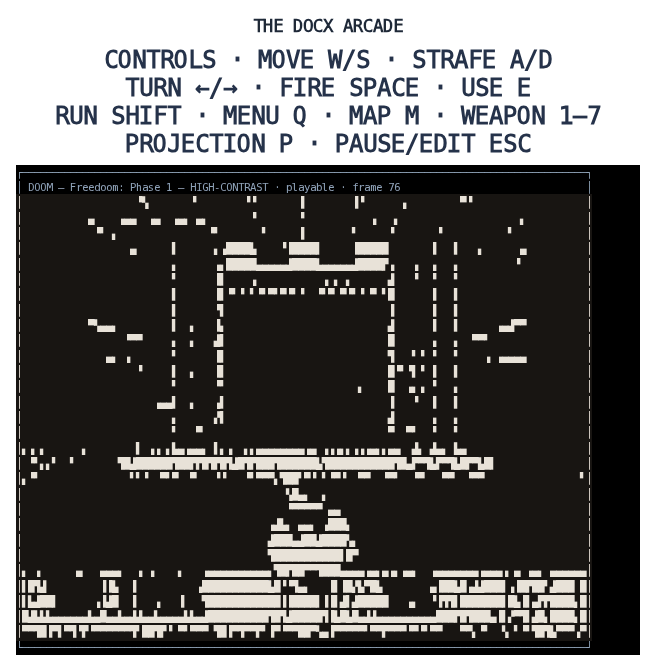
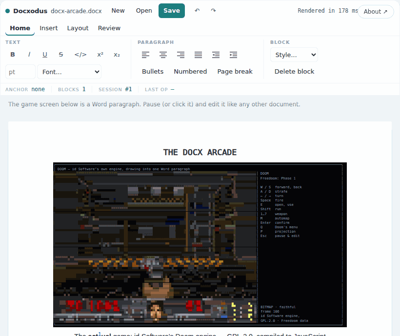
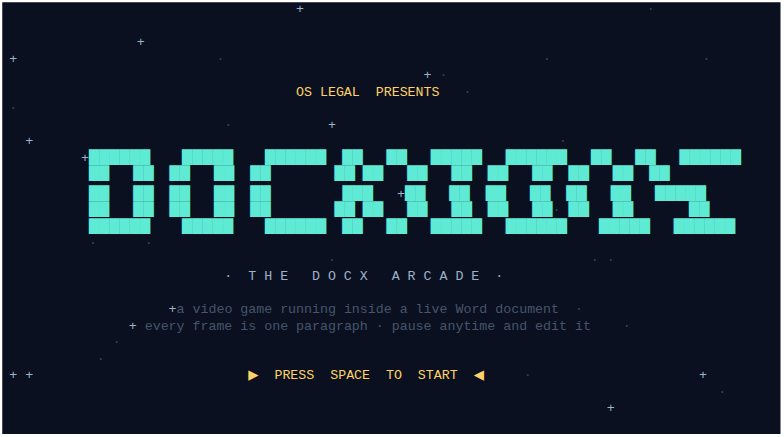
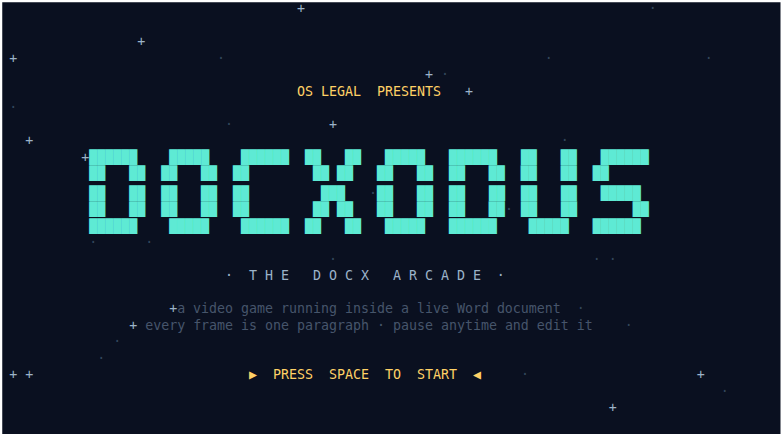
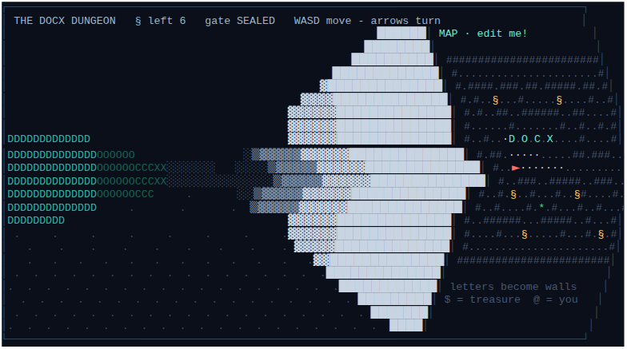
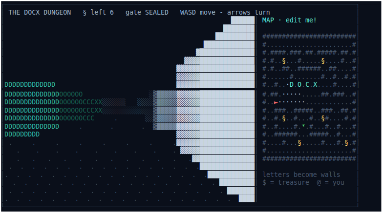

# GitHub Pages demo

Six static pages, no application server. All host the **same** editor
surface — `createRibbonEditor` from the pinned `docxodus@10.0.0` embed bundle on
jsDelivr — and differ only in how much of the page belongs to the editor:

| Page | What it is |
|------|------------|
| `index.html` | The landing page. Hero, capability cards, the embed dialog, and a live demo inside its frame. This is the URL to share; its Open Graph metadata is what social platforms read. **Below 620px the frame mounts THE DOCX ARCADE instead of the plain editor** — same shipped surface, a game running on one of its paragraphs. A phone visitor is not going to draft a contract on a 390px screen, but they will play the thing, and it demonstrates the engine harder: a document rewritten and re-rendered ten times a second, still saving as a real `.docx`. The choice is taken in a `<head>` script, before first paint, so the copy framing the frame never advertises the demo the page did not mount; `?demo=editor` / `?demo=arcade` pin either on any screen, and the page links to the other one both ways. The nav links are a horizontal scroll strip on a phone rather than `display: none` — they point at the other demo pages, which is what a phone visitor most wants. |
| `app.html` | The editor full-bleed, nothing around it. The useful thing to open on a phone. |
| `player.html` | The compact iframe target, sized for ~480 × 480. Boots on tap so a feed iframe never streams a .NET runtime unasked, and pins the surface's compact layout. |
| `observatory.html` | The DOCX Observatory inside the live editor: procedural ASCII phenomena animated onto a Word paragraph in the editor's own session (`raw.replaceXml` + `editor.refresh()`). Pause — or click the water — and it is only a document: edit with the ribbon, Undo rewinds frame by frame, Save downloads the caught wave. The phenomena and frame loop are demo content, not library machinery: they live in `ascii-scenes.js` **in this directory** (also imported, via the test-webroot copy, by the two `npm/examples/ascii-animation*` pages), so `?engine=` pins the library alone and the scenes version with the site. Needs `DocxEditor.refresh()`, which 9.5.0 predates — it was pinned to `docxodus@9.6.0` ahead of that release and healed on its own when it published; it now shares the pin with its siblings. |
| `arcade.html` | THE DOCX ARCADE — the Observatory's interactive sequel: three playable games (a ¶-starring platformer, a Doom-style raycaster, and **DOOM** — id Software's own engine, GPL-2.0, compiled to JavaScript, running on Freedoom's BSD-licensed IWAD) whose screen is the same per-frame `raw.replaceXml` + `editor.refresh()` paragraph, plus keyboard input both ways. WASD/arrows are claimed only while playing. For the two ASCII cartridges the input goes both directions: on resume the driver re-parses the game world FROM the document, so terrain typed into the paused screen (or letters typed into the raycaster's MAP panel) becomes real. Doom cannot do that and does not pretend to — its world is BSP geometry in a WebAssembly heap and the paragraph holds a picture of it — so there the round trip is pause, edit, undo and save, without the level parse. Doom's 320×200 framebuffer becomes 64×46 pixels in the bezel by packing two pixels per cell: `▀` with the top pixel as ink and the bottom as `w:shd` run shading (`█` where they agree). **P** switches that for a second projection, and the two are a study in what a character cell costs: a run breaks when the ink or shading changes but never when the glyph does. The default **8-bit** projection treats runs as a budget and allocates them — squeezing each frame to a fixed ~110 by merging whichever neighbouring runs cost the least picture to lose, then using each run's two colours as the endpoints of a ramp that the free glyph channel interpolates along. The **bitmap** one is the faithful reading instead: every colour the framebuffer had, for about three times the runs. The games live in `ascii-arcade.js` in this directory (importing shared plumbing from `ascii-scenes.js`); Doom lives in `doom-cart.js` beside it, the one GPL file in the repository; its engine and IWAD are not in the repository at all but pinned on jsDelivr — see the licensing section below. Same `?engine=` split as the Observatory, plus `?cart=quest\|dungeon\|doom`, `?wad=`, `?sound=0` and `?intro=0` to skip the "OS LEGAL presents DOCXODUS" attract screen (the title card is drawn on the same canvas paragraph; Space drops the coin). Boots on tap when iframed. Its controls come from `arcade-dock.js` (below), which the landing page mounts identically. Specs: `npm/tests/demo-arcade.spec.ts` and `npm/tests/demo-arcade-doom.spec.ts` (the latter proves real play — the engine names its own IWAD, the paragraph carries shaded half-block runs, and holding a turn key swings Doom's 3-D view while its status bar stays nailed down). |
| `golf.html` | DOCX GOLF — course play on the editing surface itself, the inverse bet from the arcade: where the arcade painted frames INTO one paragraph through `raw.replaceXml` (the escape hatch), golf makes the real clubs the game. Six holes, each a start document loaded into the live ribbon editor and a target document built beside it; the referee is the comparison engine — a hole is CLEARED when `docxDiffGetRevisions` between your document and the target returns **zero revisions**, and the caddie panel phrases whatever revisions remain as the work left (`remove "Purchasr"`, `move "Governing Law"`, `reformat "Duties" (style)`). Holes escalate across the surface: a one-word fix, clause reordering, scoped defined-term conformance, heading styles (the Style dropdown is the club — the diff cares about `w:pStyle`, not just words), and a table hole (fix a cell, delete a duplicated row from the table toolbar), plus a footnote hole played with Insert → Footnote (the referee reads note parts too). On a phone the caddie collapses to its head strip behind a toggle, and a stuck player can concede with "Show me" — the caddie plays the content-addressed reference line and the scorecard marks the hole assisted. Strokes are counted from the document, not the toolbar: the driver fingerprints `session.save()` on a poll, so one committed burst of editing is one swing, and undo counts. Par/birdie/bogey scoring, a Target view, and a live redline view (`docxDiffCompare` → `convertDocxToHtml`) round out the caddie. The game lives in `docx-golf.js` in this directory (same `?engine=` split as its siblings); its pure logic is tested by `tools/docx-golf.test.mjs`, and `npm/tests/demo-golf.spec.ts` keeps the course honest the way the engine's own evals are kept honest — no hole starts solved, and every hole's content-addressed reference solution reaches zero revisions within par. Boots on tap when iframed. |

### Both Doom projections, in the real editor

Neither is a mockup: the ribbon, the anchor bar and the Save button in these are the shipped
surface, and the game screen is one Word paragraph being rewritten and re-rendered in place.

<p>
  
  
</p>

Left, the 8-bit projection you get by default — a fixed palette on a fixed run budget, and enough
frames a second to actually play. Right, the same level after **P**: the faithful bitmap, every
colour the framebuffer had, at about a third of the rate. Both save as the same `.docx`.

### The arcade's controls (`arcade-dock.js`)

Two pages host the arcade — the cabinet and, on a phone, the landing page — so
its controls live in one module rather than being hand-written twice, for the
same reason the editor surface itself ships from `npm/src/ribbon.ts`. Density is
measured from the controls' own host, not from a viewport media query: the
landing page frames the arcade inside a card, and a narrow card in a wide page
is narrow.

| | |
|---|---|
| **wide** | One bar under the document: cartridges, transport, pacing, embed, telemetry, hint. Unchanged from the cabinet's original dock. |
| **compact** | A slim HUD strip keeps the two controls you touch mid-game (play/pause and pacing); cartridges, restart, embed, telemetry and the hint move behind a `⋯` sheet. A thumb D-pad and a round **FIRE** button float over the bottom corners of the game. Nothing is dropped, only re-placed. |

`FIRE` sends `Space` — jump in the platformer, the weapon in the raycaster and
in Doom, and the coin drop on the attract screen. The old touch row had no
Space at all, so the shooters could be walked but never fought on a phone.

The pad is deliberately not a descendant of the editor root: the driver pauses
the game on any `pointerdown` inside the document ("the frame you clicked is now
an ordinary paragraph"), so a control living in there would pause on every tap.
Compact layout moves the nodes themselves rather than duplicating them into two
hidden layouts, so `startArcade` wires its listeners once and never learns that
layout exists. Specs: the phone-shaped controls in
`npm/tests/demo-arcade-mobile.spec.ts`, and the landing page's mobile default,
nav strip and floating controls in `npm/tests/social-demo.spec.ts`.

### The canvas font, and why the ASCII pages ship one

`fonts/docxodus-canvas-mono.woff2` (17 KB) is what keeps the Observatory's
phenomena and the Arcade's game screen on their grid.

Both draw into one Word paragraph as a 92 × 26 character grid, authored for
Courier New at 8pt. A grid holds only while every cell advances the same width
— and that is a property of the font the DEVICE resolves, which the document
has no way to state. The art draws with box drawing (`─ │ ┌`), block elements
(`█ ░ ▓`) and geometric shapes (`▶ ◀ ▲ ▼`); Android has no Courier New, and the
monospace face Chrome substitutes covers none of those, so each one lands in a
proportional fallback whose advance is not the cell. Every cell after it is
displaced — by a different amount on each row, because rows hold different
numbers of them. That is the tilt reported from the field: the title card's `X`
reading as a `K`, the logo smearing off the right edge, worst exactly where the
art is densest.

| Android's font coverage reproduced, canvas unpinned | the same frame, pinned |
|---|---|
|  |  |
|  |  |

Measured on a Pixel 5 rig with that font situation reproduced, as the spread
between the widest and narrowest row of the 92-cell grid: **12.1 cells** on the
attract screen and up to **23.0** in the cartridges, against **0.07 cells** worst
case with the pin — across both viewports, all three cartridges and all four
phenomena.

So `createCanvasPin()` in `ascii-scenes.js` pins the canvas paragraph to a font
we ship, rather than hoping the platform's fallback happens to match: a subset
of DejaVu Sans Mono whose every glyph advances 1233/2048 em, identical on every
device. It pins `white-space: pre` in the same rule (a row can never wrap —
see the CHANGELOG entry for that earlier fix) and neutralizes kerning,
ligatures and inherited letter/word spacing, which are per-glyph adjustments a
grid cannot survive either. The saved `.docx` is untouched and still says
Courier New: this is a display pin, and Word has the real font.

Rebuild it with `tools/build-canvas-font.sh`, which pins the source font by
SHA-256 and refuses any other — a font that is not single-advance would not
provide the guarantee. It writes the `.woff2` and the `.json` manifest that
`tools/canvas-font.test.mjs` reads: that test drives every scene, the whole
attract-screen sweep and all three cartridges, and fails if they can draw a
character the subset does not cover. `npm/tests/demo-arcade-mobile.spec.ts`
proves the rest on a phone-shaped rig with Android's font coverage reproduced.

Docxodus stays MIT-licensed. Only the font file carries the Bitstream Vera
Fonts license (`fonts/LICENSE.txt`), which permits the subset provided it is
renamed away from "Bitstream"/"Vera" — hence "Docxodus Canvas Mono". Like the
rest of this directory it is documentation-site content and is not part of the
`docxodus` npm package.

### Doom, and what it does to the licensing

Cartridge 3 is the actual game. `doom-cart.js` drives
[doomgeneric](https://github.com/grubbyplaya/doomgenericjs) — id Software's
Doom source, GPL-2.0, compiled to JavaScript — on Freedoom's BSD-licensed
IWAD, and downsamples its 320×200 framebuffer into the canvas paragraph every
frame.

**Neither the engine nor the IWAD is in this repository.** They are 13 MB of
binary that would show up in every clone forever and never diff usefully, so
both are pinned jsDelivr URLs instead — by 40-hex commit for the engine, by tag
for the IWAD, both served with `access-control-allow-origin: *` and cached
immutably. Upstream commits, SHA-256s, license texts and verification commands
are in [`vendor/NOTICE.md`](vendor/NOTICE.md), along with what the IWAD's
sibling repository has to contain and why it needs to exist at all (GitHub
serves release assets without CORS, so a browser cannot fetch Freedoom's
release directly).

The Playwright specs do not touch the CDN for game data:
`npm/scripts/fetch-doom-iwad.mjs` pulls the release asset server-side, verifies
its digest, and drops a gzipped copy into the test webroot for the specs to
load same-origin.

**This is the one place the repository is not MIT.** `doom-cart.js` is combined
with a GPL engine at runtime, so that single file is offered under
GPL-2.0-or-later and says so in its header. Everything else — `ascii-arcade.js`
included, which imports it — stays MIT, which is GPL-compatible: each file
remains separately available under its own terms, and only the combination a
browser assembles when the Doom cartridge is selected is GPL-2.0.

The engine is behind a dynamic `import()` inside `doom-cart.js`, so a visitor
who plays the platformer or the dungeon fetches neither. `?wad=` points the
cartridge at a **same-origin** IWAD you host yourself and are licensed to play
(a retail `doom.wad` works), and `?sound=0` boots it mute.

### Two projections, and why the fast one is ASCII

**P** switches how the framebuffer reaches the paragraph, and `?projection=`
picks the starting one.

The frame budget is a single OOXML→HTML conversion of the screen paragraph,
and that is **linear in runs** — measured at roughly 35 ms fixed plus 0.70 ms
per run, across a 24× range. What makes a run is the thing worth knowing: a
run breaks when the **ink or shading** changes, and *not* when the glyph does,
because every character in a span shares one `w:t`. Glyph variation is free;
colour variation is not.

| projection | what it does | runs/frame | repaints |
|---|---|---|---|
| `8bit` (default) | A fixed 18-colour console palette and a hard run budget. Each frame is squeezed to its allowance by repeatedly merging the two adjacent runs whose merge adds the least error; each surviving run's ink and shading are then the two *endpoints* of a ramp. Every cell picks its own 2×2 arrangement of those two colours from the sixteen quadrant block characters, so the picture is sampled at **128 × 46** on 64 × 23 cells. | ~64 | ~10/s |
| `bitmap` | Every cell is two pixels — `▀` with the top pixel as ink and the bottom as `w:shd` shading. Neighbouring cells within a luma-weighted tolerance are given the same pair of colours so they merge into one run. | ~400 | ~2.7/s |

Getting there took being wrong twice, both times in the same way — treating a
cell's two channels as one.

The first was the **bitmap** projection's merge. Quantising each channel and
snapping the top and bottom pixels *independently* barely moved the run count,
which made ~1 repaint a second look like a property of the medium. It is not: a
run needs **both** halves to match, so deciding them separately makes a merge
the product of two chances. Deciding the pair jointly cut the frame by two
thirds with the same tolerance.

The second was spending each cell on only one channel at a time. An earlier
projection put all the detail in the glyph and held the ink at one grey; the
bitmap put it all in the ink and had no glyph detail. But **the glyph is free
and the ink is not**, so the right split is to allocate colour as the scarce
resource it is and let the glyph carry everything else. That is what the two
endpoints per run buy, and it is the same trade block texture compression
makes, for the same reason.

Resolution follows from the same fact. Since a run never breaks on a glyph, the
number of picture samples is not what a frame costs — the run budget is, and the
merge caps that regardless. So the quadrant blocks, which can draw all sixteen
2×2 arrangements of two colours, carry four sub-pixels per cell instead of two:
128 × 46 on the same 64 × 23 cells, measured at a 3% cost. And because the fine
structure now rides in the free channel, the colour budget can be *lower* than
it was before without the picture suffering — the two changes pay for each
other.

Two things fall out of budgeting rather than thresholding. The frame cost stops
depending on the view — measured flat at ~157 spans across four very different
parts of E1M1, where a tolerance-based projection swung by a factor of two —
and per-frame auto-exposure becomes free, because the merge returns the frame
to its allowance no matter how much contrast is fed in. Exposure had been
rejected earlier for costing runs; under a budget that objection disappears,
and it is the single biggest legibility win available.

### The screen is fenced away from the caption

A single-block re-render does not render the block alone. The engine pads each
target with **one real neighbour on each side** before converting it, so that
`w:contextualSpacing` resolves exactly as it would in a full render; those
context clones are discarded once the target's HTML is extracted. That is
correct, and cheap — unless a neighbour is large.

The screen's lower neighbour was the caption: a formatted prose paragraph of 36
runs carrying a footnote reference, converted in full on every frame of every
game purely as context, then thrown away. Fencing the screen with two
one-character paragraphs moves it out of that slot, measured **7.4 → 8.8
repaints a second** and A/B'd inside one browser process so the container's
drift could not be mistaken for the change.

The fence has to be the boundary of the litter sweep too. `syncFromDocument`
deletes stray paragraphs between the screen and the caption, so that pausing to
edit cannot slowly fill the document with Enter-splits — and on the first
attempt it dutifully deleted the fence on the first pause. It now sweeps up to
the fence rather than past it.

That, plus trimming the colour budget to 64 runs, is what takes the cartridge to
**~10.4 repaints a second**.

The chrome turned out to matter as much as the picture. The bezel, divider and
side panel were five colours, and a run breaks on a colour *change* — so those
five cost five runs on every one of the 23 picture rows, 166 runs, more than
half the frame, for a column of static text. They now share one ink. Rows are
independent, so a row may still spend a second colour when it earns one.

Both are the same Doom and the same document, and either one saves as a `.docx`
the same way.

There is deliberately no engine override. `import()` executes whatever it
fetches, on this page's origin and with its privileges, so a URL parameter
naming the module would be remote code execution from a crafted link rather
than a knob. The cartridge's URL gate allows exactly its own pin plus
same-origin, and nothing else.

The demo stays a documentation-site concern. Neither its runtime nor the Doom
cartridge's third-party dependencies are included in the `docxodus` npm
tarball: the package
publishes an explicit allowlist of library JavaScript, declarations, and WASM
runtime files, and `npm run test:package-boundary` audits the actual packed
manifest after the Playwright webroot has been populated.

The surface itself is **not** written here — it ships in the npm package
(`npm/src/ribbon.ts`). These pages used to carry a hand-written toolbar each,
which drifted until the demo advertised a smaller editor than the one that
shipped. Changing the editor's UI means changing the module, not these files.

The sample document is the branded product guide in this directory; regenerate
it with `python tools/generate-demo-guide.py` from the repository root.

## Publish

1. Publish `docxodus@10.0.0` and confirm
   `https://cdn.jsdelivr.net/npm/docxodus@10.0.0/dist/embed.bundle.js` returns JavaScript.
2. In GitHub **Settings → Pages**, choose **GitHub Actions** as the publishing source.
   The `Deploy static demo to GitHub Pages` workflow uploads `/docs` without
   running Jekyll.
3. Open `https://jsv4.github.io/Docxodus/demo/` and verify the status chip becomes `Live`.
4. If the site is hosted anywhere else, update the absolute `og:url`, `og:image`,
   and `twitter:image` values in `index.html` and `app.html` before sharing.

All the pages accept query overrides for local or preview testing:

```text
?engine=<module URL of embed.bundle.js>&doc=<CORS-readable DOCX URL>
```

`app.html` also takes `?blank=1` to start from a new empty document.
`index.html` takes `?demo=arcade|editor` to pin which demo the frame mounts
(otherwise a phone gets the arcade and a desktop the editor), plus the arcade's
own `?cart=` and `?intro=0` when it is the one mounted.

## Social-platform expectations

- LinkedIn uses the landing page's Open Graph title, description, and image. It
  does not run the editor inside the feed; the user clicks through to the live page.
- X receives a `summary_large_image` link card. Its current developer docs no
  longer document historical Player Cards, so the page does not promise an
  interactive editor inside a post. `player.html` is for iframe-capable sites.
- The Playwright specs (`npm/tests/social-demo.spec.ts`) validate the static
  metadata, boot-on-tap behaviour, the live editor, and the responsive collapse —
  locally. They cannot prove how an external social client will render a post.
